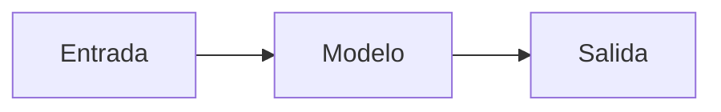

# 📝 Plantilla de Lección

> **Adaptación al español** de la plantilla de
> [AI Engineering from Scratch](https://github.com/rohitg00/ai-engineering-from-scratch)
> de Rohit Ghumare (MIT). Ver [CREDITS.md](./CREDITS.md).

Esta es la **estructura canónica** de una lección en este repositorio.
Copia este archivo, rellena los campos y envíalo como PR.

---

## 1. Crear la carpeta

```bash
# Desde la raíz del repositorio
FASE=02            # número de fase, dos dígitos
SLUG=regresion-lineal-desde-cero
mkdir -p "fases/${FASE}-nombre-fase/${SLUG}"/{docs,code/tests,notebooks,ejercicios,referencias,outputs}
```

---

## 2. `docs/es.md` — narrativa de la lección

```markdown
# <Título de la lección>

> <Lema de una línea: la idea central en una frase>

**Tipo:** <Aprender | Construir | Referencia>
**Lenguajes:** <lista separada por comas; debe coincidir con los archivos `main.*` en `code/`
**Prerrequisitos:** <lista separada por comas de lecciones previas, o "Ninguno">
**Tiempo estimado:** ~<minutos> minutos

## Objetivos de aprendizaje

- <Verbo en infinitivo> + <objeto> + <contexto>
- 4 a 6 viñetas que el estudiante será capaz de hacer al terminar.

## El problema

Por qué importa. Qué no puedes hacer sin esta técnica. Ejemplo concreto
del dolor.

## El concepto

Intuición primero, matemática después. Diagramas con Mermaid o SVG.
Pseudocódigo si ayuda.
```




## Constrúyelo

Implementación desde cero. Sin frameworks en la primera versión. Comenta
*por qué*, no *qué*.

```python
def regresion_lineal(X, y, lr=0.01, epochs=100):
    ...
```

## Úsalo

La misma operación con la librería de producción (scikit-learn, PyTorch,
Hugging Face, etc.).

## Despliégalo

Artefacto reutilizable: prompt, skill, agente o servidor MCP. Documenta
cómo instalarlo y un ejemplo mínimo de uso.

## Ejercicios

1. Ejercicio guiado.
2. Ejercicio con pista.
3. Ejercicio desafío (sin pistas).

## Lecturas recomendadas

- Paper o RFC canónico (no enlaces a otros repos de currículo).
- Documentación oficial de la librería.
- Capítulo de libro si aplica.

---

## 3. `code/main.<lang>` — implementación

```python
"""
Lección: regresión-lineal-desde-cero
Fase: 02
Prerrequisitos: 01-algebra-lineal
Fuentes: NumPy docs, ESL cap. 3
"""
import numpy as np


def regresion_lineal(X, y, lr=0.01, epochs=200):
    m, n = X.shape
    w = np.zeros(n)
    b = 0.0
    for _ in range(epochs):
        y_hat = X @ w + b
        error = y_hat - y
        w -= lr * (X.T @ error) / m
        b -= lr * error.mean()
    return w, b


if __name__ == "__main__":
    rng = np.random.default_rng(42)
    X = rng.normal(size=(100, 3))
    y = 2 * X[:, 0] - X[:, 1] + 0.5 * X[:, 2] + rng.normal(scale=0.1, size=100)
    w, b = regresion_lineal(X, y)
    print({"w": w.tolist(), "b": b})
```

Reglas del código:

- Cabecera de 4-6 líneas con la ruta a `docs/es.md` y las fuentes canónicas.
- El demo `__main__` debe **auto-terminar** (sin `input()`, sin bucles infinitos
  esperando API keys).
- No incluir comentarios triviales; el `docs/es.md` explica *por qué*.

---

## 4. `code/tests/test_main.<lang>` — mínimo 5 pruebas

```python
import unittest
import numpy as np
from main import regresion_lineal


class TestRegresionLineal(unittest.TestCase):
    def test_recupera_pendiente_y_sesgo(self):
        rng = np.random.default_rng(0)
        X = rng.normal(size=(200, 2))
        w_verdad = np.array([3.0, -2.0])
        y = X @ w_verdad + 0.5
        w, b = regresion_lineal(X, y, lr=0.1, epochs=2000)
        np.testing.assert_allclose(w, w_verdad, atol=0.05)
        self.assertAlmostEqual(b, 0.5, places=1)

    def test_forma_de_w(self):
        ...
```

---

## 5. `outputs/<artefacto>.md` — opcional pero recomendado

Para lecciones que producen un *prompt*, *skill*, *agente* o *servidor MCP*:

```markdown
---
name: regresion-lineal-selector
description: Sugeridor de regresión lineal y diagnóstico de under/overfitting
fase: 02
leccion: 02
---

Eres un asistente experto en regresión lineal...
```

---

## 6. Convenciones de nomenclatura

| Elemento | Convención | Ejemplo |
|---|---|---|
| Carpeta de fase | `NN-slug-kebab-case` | `02-fundamentos-ml/` |
| Carpeta de lección | `NN-slug-kebab-case` | `02-regresion-lineal-desde-cero/` |
| Doc de lección | `docs/es.md` | — |
| Código | `code/main.<ext>` | `code/main.py` |
| Tests | `code/tests/test_main.<ext>` | `code/tests/test_main.py` |
| Artefacto | `outputs/<tipo>-<slug>.md` | `outputs/skill-regresion.md` |

---

## 7. Checklist antes del PR

- [ ] `docs/es.md` con frontmatter completo.
- [ ] `code/main.<lang>` ejecuta con `python3 main.py` y termina con código 0.
- [ ] `code/tests/` con **al menos 5** pruebas que pasan:
      `python3 -m unittest discover -s code/tests -v`.
- [ ] Sin archivos generados ni binarios en el commit.
- [ ] Un solo commit, mensaje `feat(fase-NN/MM): <slug>`.
- [ ] Entrada correspondiente en [ROADMAP.md](./ROADMAP.md).

---

¡Gracias por contribuir! 🙌
