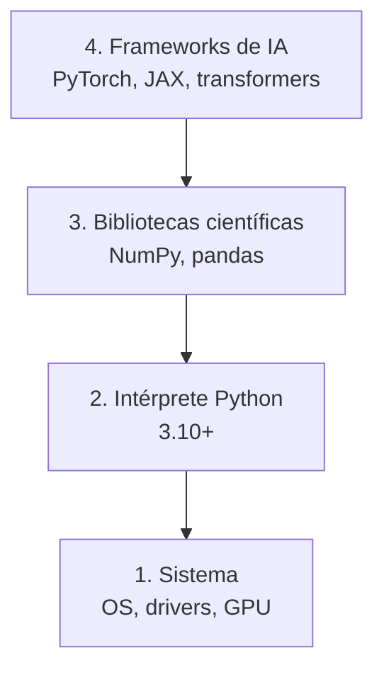

# Entorno de desarrollo

> Tus herramientas moldean tu pensamiento. Configúralas una vez, configúralas bien.

**Tipo:** Construir
**Lenguajes:** Python
**Prerrequisitos:** Ninguno
**Tiempo estimado:** ~45 minutos

## Objetivos de aprendizaje

- Verificar que el entorno Python mínimo funciona para ingeniería de IA.
- Diagnosticar capas del entorno (intérprete, bibliotecas, GPU) de forma sistemática.
- Producir un informe de entorno que se pueda archivar y compartir.
- Detectar y reportar las cinco fallas más comunes al empezar un proyecto de IA.

## El problema

Vas a pasar las próximas fases construyendo modelos, agentes y servicios
de IA. Si el entorno está roto, cada lección se vuelve una pelea contra
versiones, drivers y paths. La mayoría de la gente se salta esta lección
y termina dedicando horas a `pip install` que no resuelve nada.

Necesitamos una herramienta pequeña y determinista que:

1. Recorra las capas del entorno (intérprete, paquetes, GPU, sistema).
2. Reporte el estado de cada capa como pasa/falla con detalle.
3. Produzca un JSON que puedas archivar junto al proyecto y comparar
   contra futuros cambios.

## El concepto

Un entorno de IA tiene cuatro capas. Cada capa depende de la de abajo:



Si la capa 1 falla, nada arriba funciona. Si la 2 está mal configurada,
los frameworks dan `ImportError` crípticos. Por eso empezamos verificando
de abajo hacia arriba.

Las verificaciones devuelven uno de tres resultados:

- `pass` — la capa está presente y funcional.
- `warn` — la capa existe pero algo falta (p. ej. CUDA no disponible).
- `fail` — la capa no está disponible y bloquea el trabajo.

## Constrúyelo

Implementamos un verificador de entorno con tres ideas:

1. **Cada check es una tupla** `(nombre, callable, callable_detalle?)` para
   mantener la lista fácil de leer y extender.
2. **El reporte agrega** el detalle opcional (versión, ruta) cuando está
   disponible, sin obligar a que cada check lo provea.
3. **La salida es un dict Python** que se serializa a JSON para archivar.

```python
"""
Lección: 01-entorno-desarrollo
Fase: 00
Prerrequisitos: Ninguno
Fuentes:
- Python: https://docs.python.org/3/library/sys.html
- PyTorch: https://pytorch.org/docs/stable/notes/cuda.html
"""
from __future__ import annotations

import json
import platform
import shutil
import sys
from typing import Callable, Optional

CheckResult = tuple[str, str, Optional[str]]
# (nombre, estado, detalle)


def check(name: str, predicate: Callable[[], bool], detail: Callable[[], str] | None = None) -> CheckResult:
    """Ejecuta `predicate` y reporta el estado. `detail` se llama sólo si
    el check pasó, para obtener información extra (versión, ruta, etc.)."""
    try:
        ok = bool(predicate())
    except Exception as exc:
        return (name, "fail", f"{type(exc).__name__}: {exc}")
    if not ok:
        return (name, "fail", None)
    info = detail() if detail else None
    return (name, "pass", info)


def check_python() -> CheckResult:
    major, minor = sys.version_info[:2]
    passed = (major, minor) >= (3, 10)
    if not passed:
        return ("python", "fail", f"{major}.{minor}")
    return ("python", "pass", f"{major}.{minor}.{sys.version_info.micro}")


def check_import(module: str) -> CheckResult:
    try:
        mod = __import__(module)
    except Exception as exc:
        return (module, "fail", str(exc))
    ver = getattr(mod, "__version__", "desconocida")
    return (module, "pass", f"v{ver}")


def check_command(binary: str) -> CheckResult:
    path = shutil.which(binary)
    if path is None:
        return (binary, "fail", None)
    return (binary, "pass", path)


def check_pytorch_cuda() -> CheckResult:
    try:
        import torch
    except Exception:
        return ("torch-cuda", "warn", "PyTorch no instalado")
    try:
        disponible = bool(torch.cuda.is_available())
    except Exception as exc:
        return ("torch-cuda", "fail", str(exc))
    if not disponible:
        return ("torch-cuda", "warn", "CPU only (CUDA no disponible)")
    nombre = torch.cuda.get_device_name(0)
    return ("torch-cuda", "pass", nombre)


def verificar_entorno() -> dict:
    """Ejecuta todas las verificaciones y devuelve el reporte."""
    checks: list[CheckResult] = [
        check_python(),
        check_import("numpy"),
        check_command("git"),
    ]
    try:
        checks.append(check_import("torch"))
        checks.append(check_pytorch_cuda())
    except Exception:
        pass
    return {
        "sistema": platform.platform(),
        "python": sys.version.split()[0],
        "checks": [
            {"nombre": n, "estado": e, "detalle": d}
            for n, e, d in checks
        ],
    }


def main() -> int:
    reporte = verificar_entorno()
    print(json.dumps(reporte, indent=2, ensure_ascii=False))
    fallaron = [c for c in reporte["checks"] if c["estado"] == "fail"]
    if fallaron:
        print(f"\nATENCIÓN: {len(fallaron)} checks fallaron.", file=sys.stderr)
        return 1
    return 0


if __name__ == "__main__":
    sys.exit(main())
```

## Úsalo

Ejecuta el verificador y guarda el reporte para tu proyecto:

```bash
python3 code/main.py > entorno.json
```

Las claves importantes del JSON:

- `sistema` y `python`: identifican la plataforma.
- `checks`: lista con tres campos por entrada.
- `estado` ∈ {`pass`, `warn`, `fail`}.
- `detalle` es opcional y trae versión, ruta o nombre de dispositivo.

## Despliégalo

Una vez tienes el verificador, el artefacto reutilizable es el **prompt
de diagnóstico de entorno**: pega el JSON de salida al LLM y pídele que
diagnostique las fallas y proponga comandos exactos.

```markdown
---
name: prompt-entorno-ia-diagnostico
description: Diagnosticar y arreglar problemas de entorno de IA a partir de un JSON
fase: 00
leccion: 01
---

Eres un técnico de entornos de IA. Recibirás un JSON con el resultado
de una verificación de entorno. Tu trabajo:

1. Identifica los checks con estado `fail` o `warn`.
2. Para cada uno, propón el comando exacto de arreglo, no una guía
   genérica.
3. Si el problema es de drivers de GPU, sugiere primero
   `nvidia-smi --query-gpu=name --format=csv` para confirmar hardware.
4. No asumas el sistema operativo: léelo del campo `sistema`.
```

## Ejercicios

1. **Extensión**: añade un check para `psutil` que reporte el número
   de cores y la RAM disponible. Pista: `psutil.cpu_count()` y
   `psutil.virtual_memory().total`.
2. **Persistencia**: modifica `main()` para que el JSON se guarde en
   `entorno-<timestamp>.json` en lugar de imprimirse a stdout.
3. **Desafío**: añade un check de espacio en disco libre en la ruta
   actual. Falla si hay menos de 5 GB. Pista: `shutil.disk_usage('.')`.

## Lecturas recomendadas

- `sys` module: <https://docs.python.org/3/library/sys.html>
- `platform` module: <https://docs.python.org/3/library/platform.html>
- PyTorch CUDA setup: <https://pytorch.org/get-started/locally/>
- `shutil.which`: <https://docs.python.org/3/library/shutil.html#shutil.which>

---

> 📚 **Adaptación al español** de la lección
> "[Dev Environment]" del currículo
> [AI Engineering from Scratch](https://github.com/rohitg00/ai-engineering-from-scratch)
> (Rohit Ghumare, MIT). Implementación y documentación reescritas
> desde cero. Ver [CREDITS.md](../../../../CREDITS.md).
