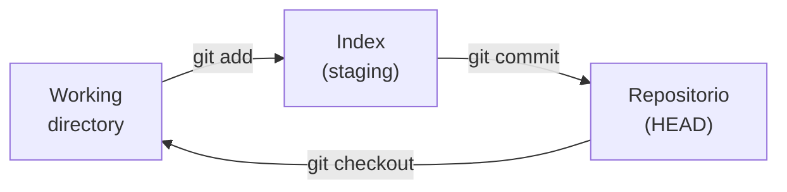
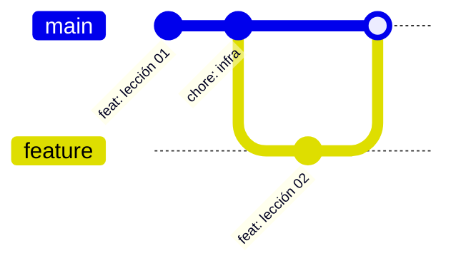

# Git y colaboración

> Versionar tu trabajo es la diferencia entre un experimento y un proyecto reproducible.

**Tipo:** Aprender
**Lenguajes:** Bash
**Prerrequisitos:** 01-entorno-desarrollo
**Tiempo estimado:** ~60 minutos

## Objetivos de aprendizaje

- Inicializar un repositorio Git y configurar identidad por proyecto.
- Aplicar el flujo `add → commit → push` con mensajes convencionales.
- Trabajar con ramas, fusiones y resolución de conflictos simples.
- Diagnosticar el estado de un repositorio con `git status`, `git log` y `git diff`.
- Aplicar las reglas del currículo: un commit por lección, asunto de 72 caracteres.

## El problema

Cuando empiezas a escribir código, "guardar" significa sobrescribir.
Eso funciona hasta que introduces un bug y no recuerdas qué version
funcionaba. Git resuelve eso: cada commit es una foto inmutable de tu
trabajo, con un autor, fecha y mensaje.

En el currículo, además, necesitamos un formato estricto de commits
para que la historia del repositorio sea legible y automatizable.
Por eso esta lección no es opcional: la vamos a aplicar desde la
primera línea de código que escribas.

## El concepto

Git tiene tres estados principales para tus archivos:



- **Working directory**: lo que ves en tu carpeta.
- **Index (staging)**: lo que será parte del próximo commit.
- **Repositorio (.git)**: la historia inmutable.

Cada commit es un **snapshot** completo con un puntero al commit padre.
Las ramas son simplemente punteros móviles a commits.



## Constrúyelo

Construimos un script Bash que aplica la convención del currículo a
cualquier repo:

```bash
#!/usr/bin/env bash
# Lección: 02-git-colaboracion
# Fase: 00
# Prerrequisitos: 01-entorno-desarrollo
# Fuentes:
# - Pro Git (libre): https://git-scm.com/book/es/v2
# - Conventional Commits: https://www.conventionalcommits.org/es/

set -euo pipefail

CONVENCION='^(feat|fix|docs|style|refactor|test|chore|perf|build|ci)\([a-z0-9-]+/[0-9]+\): .+.{1,72}$'
MAX_LONGITUD=72
MIN_LONGITUD=10

uso() {
  cat <<EOF
Uso: $(basename "$0") <opcion>

  check    Verifica que el repo está bien configurado
  sample   Crea un commit de ejemplo
  report   Muestra un informe del estado del repo
EOF
}

verificar_repo() {
  if ! git rev-parse --is-inside-work-tree >/dev/null 2>&1; then
    echo "ERROR: no estás dentro de un repositorio git"
    return 1
  fi
  local rama
  rama=$(git rev-parse --abbrev-ref HEAD)
  echo "OK: repo válido en rama '$rama'"
}

verificar_identidad() {
  local nombre correo
  nombre=$(git config user.name || echo "")
  correo=$(git config user.email || echo "")
  if [ -z "$nombre" ] || [ -z "$correo" ]; then
    echo "FALTA: configura tu identidad con:"
    echo "  git config user.name  'Tu Nombre'"
    echo "  git config user.email 'tu@correo'"
    return 1
  fi
  echo "OK: identidad = $nombre <$correo>"
}

verificar_mensaje() {
  local asunto="$1"
  if [ ${#asunto} -gt $MAX_LONGITUD ]; then
    echo "FALLA: asunto de ${#asunto} caracteres (>${MAX_LONGITUD})"
    return 1
  fi
  if ! [[ "$asunto" =~ $CONVENCION ]]; then
    echo "FALLA: '$asunto' no sigue la convención feat(fase-NN/MM): <slug>"
    return 1
  fi
  echo "OK: '$asunto' cumple la convención"
}

reporte() {
  echo "=== Reporte del repositorio ==="
  echo "Rama actual:    $(git rev-parse --abbrev-ref HEAD)"
  echo "Último commit:  $(git log -1 --format='%h %s' 2>/dev/null || echo 'sin commits')"
  echo "Cambios staged: $(git diff --cached --name-only | wc -l | tr -d ' ')"
  echo "Cambios sin stage: $(git diff --name-only | wc -l | tr -d ' ')"
  echo "Ramas:          $(git branch --format='%(refname:short)' | tr '\n' ' ')"
}

case "${1:-}" in
  check) verificar_repo && verificar_identidad ;;
  sample) verificar_mensaje "feat(fase-00/02): ejemplo-de-mensaje" ;;
  report) verificar_repo >/dev/null && reporte ;;
  *) uso ;;
esac
```

## Úsalo

```bash
chmod +x code/main.sh
./code/main.sh check
./code/main.sh sample
./code/main.sh report
```

Aplica el formato en cada lección que crees:

```bash
git add fases/00-configuracion-y-herramientas/02-git-colaboracion/
git commit -m "feat(fase-00/02): git-colaboracion"
git push
```

## Ejercicios

1. **Identidad por proyecto**: crea una carpeta `~/proyecto-test`,
   entra y ejecuta `git init` seguido de `git config user.name` y
   `git config user.email` con valores distintos a los globales.
   Verifica con `git config --list --local`.
2. **Resolución de conflicto**: en una rama nueva, modifica la
   primera línea de `README.md`. Cambia a `main`, modifica la misma
   línea, haz commit. Vuelve a la rama anterior e intenta `git
   merge main`. Resuelve el conflicto a mano.
3. **Desafío**: añade al script `main.sh` un comando `count` que
   cuente cuántos commits del repo siguen la convención y cuántos
   no. Pista: `git log --format='%s' | grep -E "$CONVENCION"`.

## Lecturas recomendadas

- *Pro Git* (libre, en español): <https://git-scm.com/book/es/v2>
- Conventional Commits: <https://www.conventionalcommits.org/es/>
- Documentación oficial: <https://git-scm.com/docs>
- `man gitrepository-layout` para entender el directorio `.git`.

---

> 📚 **Adaptación al español** de la lección
> "[Git and Collaboration]" del currículo
> [AI Engineering from Scratch](https://github.com/rohitg00/ai-engineering-from-scratch)
> (Rohit Ghumare, MIT). Implementación y documentación reescritas
> desde cero. Ver [CREDITS.md](../../../../CREDITS.md).
