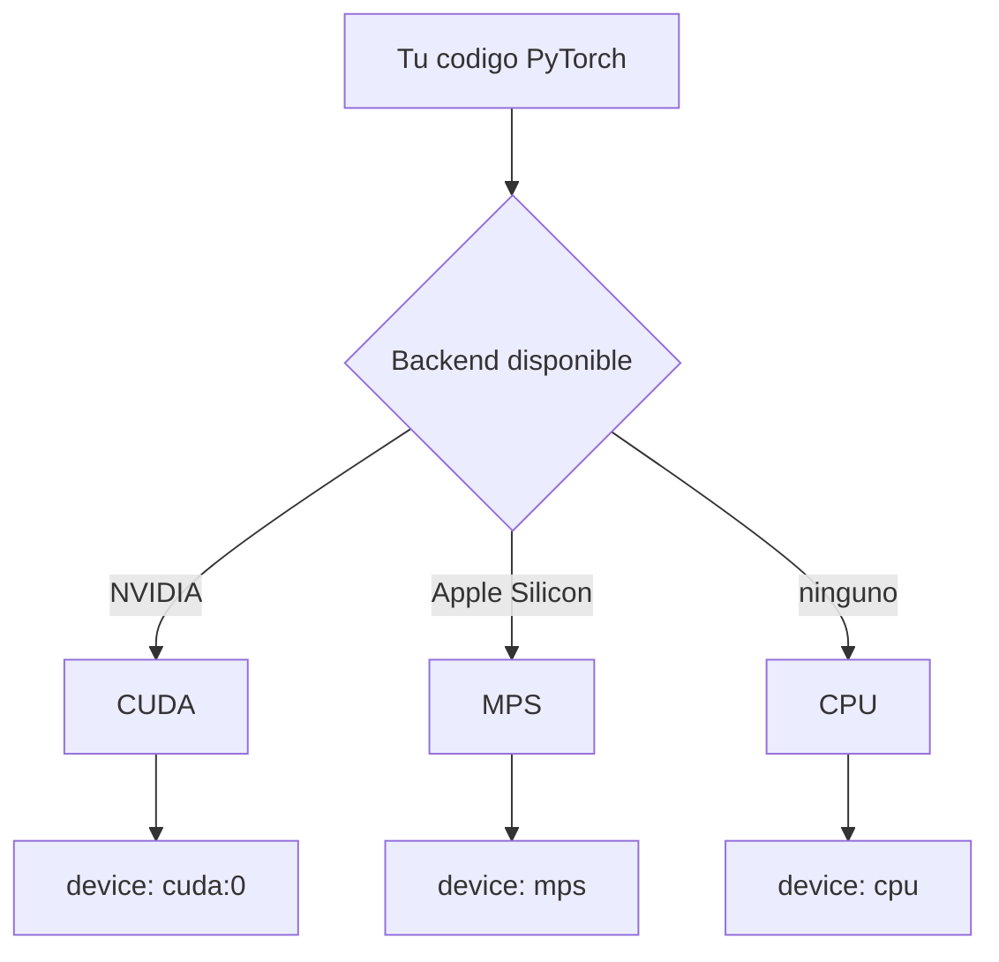

# Configuracion de GPU y nube

> Entrenar un modelo pequeno en CPU duele; entrenarlo en una GPU bien configurada es trivial. La diferencia esta en configurar.

**Tipo:** Construir
**Lenguajes:** Python
**Prerrequisitos:** 01-entorno-desarrollo
**Tiempo estimado:** ~60 minutos

## Objetivos de aprendizaje

- Diagnosticar la disponibilidad de GPU en local (CUDA, MPS, ROCm).
- Distinguir entre tres backends: NVIDIA CUDA, Apple Silicon MPS, CPU.
- Medir el ancho de banda y la memoria de una GPU cuando esta disponible.
- Evaluar opciones de nube (Colab, Kaggle, Lambda Labs, Vast.ai) segun costo y disponibilidad.
- Construir un selector de backend que elija automaticamente el mejor disponible.

## El problema

Tu laptop o workstation puede tener una GPU potente que no estas
usando, o una CPU modesta para la cual necesitas arrendar capacidad.
El primer paso para entrenar modelos es saber donde corre cada cosa.

Hay tres backends comunes:

- **CUDA**: GPUs NVIDIA. El mas usado en IA. Requiere drivers + toolkit.
- **MPS**: Apple Silicon (M1/M2/M3/M4). Soporte oficial en PyTorch.
- **CPU**: siempre disponible, 10-100x mas lento que una GPU moderna.

Ademas, la nube ofrece GPUs bajo demanda cuando la local no alcanza.
Elegir el backend correcto evita el tipico error de "entrene durante
3 horas y descubri que estaba en CPU".

## El concepto



PyTorch 2.x detecta automaticamente el mejor backend. La pregunta es:
como diagnosticarlo antes de mover un tensor enorme.

## Constrúyelo

Implementamos un selector de backend con cuatro detecciones:

1. CUDA via `torch.cuda`.
2. MPS via `torch.backends.mps`.
3. ROCm via `torch.cuda` (mismo API, distinto driver).
4. Fallback CPU.

```python
"""
Lección: 03-gpu-nube
Fase: 00
Prerrequisitos: 01-entorno-desarrollo
Fuentes:
- PyTorch CUDA: https://pytorch.org/docs/stable/notes/cuda.html
- MPS backend: https://pytorch.org/docs/stable/notes/mps.html
"""
from __future__ import annotations

import json
import platform
import sys
from typing import Optional


def detectar_cuda() -> Optional[dict]:
    try:
        import torch
    except Exception:
        return None
    if not torch.cuda.is_available():
        return None
    return {
        "backend": "cuda",
        "dispositivo": torch.cuda.get_device_name(0),
        "cantidad": torch.cuda.device_count(),
        "version_cuda": torch.version.cuda,
    }


def detectar_mps() -> Optional[dict]:
    try:
        import torch
    except Exception:
        return None
    if not torch.backends.mps.is_available():
        return None
    if not torch.backends.mps.is_built():
        return None
    return {
        "backend": "mps",
        "dispositivo": "Apple Silicon GPU",
        "cantidad": 1,
    }


def detectar_cpu() -> dict:
    return {
        "backend": "cpu",
        "dispositivo": platform.processor() or "CPU",
        "cantidad": 1,
    }


def seleccionar_backend() -> dict:
    """Devuelve el mejor backend disponible, con detalle."""
    info = detectar_cuda() or detectar_mps() or detectar_cpu()
    if info["backend"] == "cuda":
        info["recomendacion"] = "entrenar local en GPU NVIDIA"
    elif info["backend"] == "mps":
        info["recomendacion"] = "entrenar local con Apple Silicon"
    else:
        info["recomendacion"] = "usar Colab o Kaggle para GPU gratuita"
    return info


def main() -> int:
    info = seleccionar_backend()
    print(json.dumps(info, indent=2, ensure_ascii=False))
    return 0


if __name__ == "__main__":
    sys.exit(main())
```

## Úsalo

```bash
python3 code/main.py
```

Salida esperada (ejemplo en Mac M2 sin torch):

```json
{
  "backend": "cpu",
  "dispositivo": "arm",
  "cantidad": 1,
  "recomendacion": "usar Colab o Kaggle para GPU gratuita"
}
```

En una maquina con CUDA veras el nombre de la GPU, la cantidad, y la
version de CUDA instalada.

## Despliégalo

Si el verificador detecta que no hay GPU, el artefacto reutilizable es
un **prompt de eleccion de nube** que recomienda el servicio segun el
presupuesto y la urgencia.

```markdown
---
name: prompt-eleccion-gpu-nube
description: Recomendar un proveedor de GPU en la nube segun el caso de uso
fase: 00
leccion: 03
---

Eres un asesor de infraestructura para IA. Recibiras:

- Tipo de modelo a entrenar (tamano en parametros).
- Tamano del dataset (en GB).
- Presupuesto (USD/dia).
- Plazo (dias).

Devuelve una tabla con 3-4 opciones concretas:

- Proveedor (Colab, Kaggle, Lambda Labs, Vast.ai, RunPod, GCP, AWS).
- GPU recomendada (T4, A10, A100, H100).
- Costo estimado (USD/hora).
- Tiempo estimado de entrenamiento.
- Limitaciones conocidas (cuota gratuita, region, etc.).
```

## Ejercicios

1. **Comparacion de backends**: en una maquina con varias opciones,
   crea un tensor de 1024x1024 en cada backend y mide el tiempo de
   una multiplicacion. Pista: usa `torch.tensor(...).to(device)` y
   `time.perf_counter()`.
2. **Limite de memoria**: si tienes CUDA, ejecuta
   `torch.cuda.mem_get_info()` antes y despues de asignar un tensor
   grande. Reporta la diferencia.
3. **Desafio**: anade al selector una estimacion de tokens-por-segundo
   para inferencia segun el backend. Pista: el orden de magnitud es
   CPU 10-50 tok/s, M2 100-300, RTX 3090 1000-3000, A100 5000-15000.

## Lecturas recomendadas

- PyTorch CUDA notes: <https://pytorch.org/docs/stable/notes/cuda.html>
- PyTorch MPS: <https://developer.apple.com/metal/pytorch/>
- Google Colab (gratis): <https://colab.research.google.com/>
- Kaggle Notebooks (gratis, 30h/sem GPU): <https://www.kaggle.com/code>
- Vast.ai marketplace: <https://vast.ai/>

---

> 📚 **Adaptacion al espanol** de la leccion
> "[GPU Setup and Cloud]" del curriculo
> [AI Engineering from Scratch](https://github.com/rohitg00/ai-engineering-from-scratch)
> (Rohit Ghumare, MIT). Implementacion y documentacion reescritas
> desde cero. Ver [CREDITS.md](../../../../CREDITS.md).
