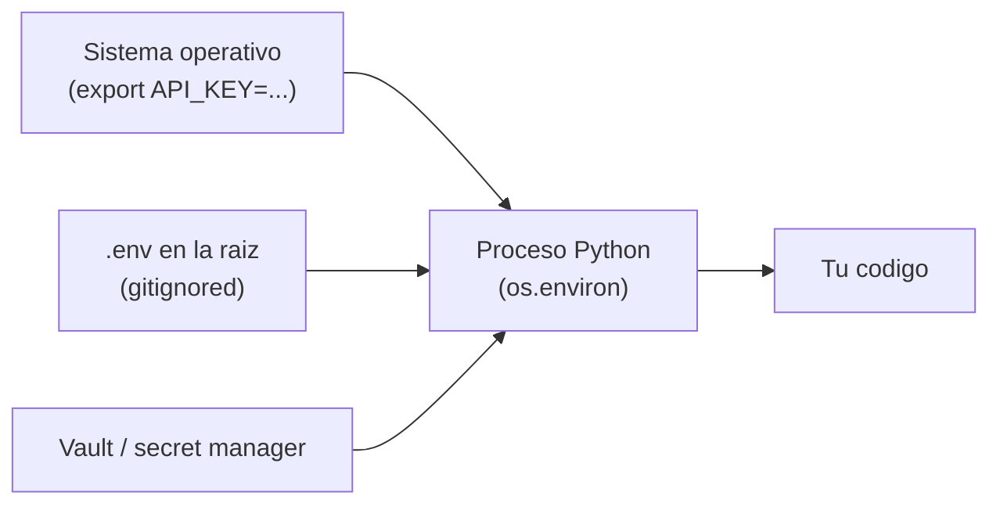

# APIs y claves

> Las claves de API son contraseñas. Trátalas como tales.

**Tipo:** Construir
**Lenguajes:** Python
**Prerrequisitos:** 01-entorno-desarrollo, 02-git-colaboracion
**Tiempo estimado:** ~45 minutos

## Objetivos de aprendizaje

- Cargar claves de API desde variables de entorno sin hardcodearlas.
- Validar el formato de claves comunes (OpenAI, Anthropic, Hugging Face).
- Configurar `.env` y `.gitignore` correctamente.
- Diagnosticar el error tipico "clave no encontrada" o "401 Unauthorized".
- Construir un cliente HTTP minimo que no requiera librerias externas.

## El problema

Casi todo lo que haras a partir de la fase 10 (LLMs) requiere una
clave de API. El error mas comun de los principiantes es pegar la
clave directamente en el codigo y commitearla al repositorio.
Aunque borres la clave en el siguiente commit, Git la recuerda
para siempre en el historial.

Necesitamos una forma sistematica de:

1. Cargar claves desde variables de entorno o un archivo `.env`.
2. Validar su formato antes de usarlas.
3. Diagnosticar rapidamente cuando algo falla (401, 404, 429).
4. Nunca escribir la clave en un archivo rastreado por Git.

## El concepto

Tres lugares donde vive una clave:



El `.env` es el mas comodo en desarrollo. El secret manager es
obligatorio en produccion. Las variables de entorno del sistema
funcionan para CI.

Reglas de oro:

1. **Nunca** escribas la clave en un archivo que Git pueda trackear.
2. **Nunca** la imprimas en logs.
3. **Siempre** rotala si crees que se filtró.
4. **Preferentemente** usa un prefijo (ej. `OPENAI_API_KEY`) para
   distinguir servicios.

## Constrúyelo

Implementamos un cargador de claves con tres validaciones:

1. Existe la variable.
2. Tiene el formato esperado (prefijo de OpenAI es `sk-...`).
3. No es el placeholder tipico (`"your-key-here"`, `"xxx"`).

```python
"""
Lección: 04-apis-y-claves
Fase: 00
Prerrequisitos: 01-entorno-desarrollo, 02-git-colaboracion
Fuentes:
- os.environ: https://docs.python.org/3/library/os.html
- urllib: https://docs.python.org/3/library/urllib.request.html
- OpenAI auth: https://platform.openai.com/docs/api-reference/authentication
"""
from __future__ import annotations

import json
import os
import sys
from pathlib import Path
from urllib import error, request


PLACEHOLDERS = {"", "your-key-here", "xxx", "changeme", "sk-xxx", "<your-key>"}


def cargar_env(archivo: Path = Path(".env")) -> int:
    """Carga pares CLAVE=valor desde un archivo .env. Retorna cuantos se
    cargaron. No sobrescribe variables ya definidas en el sistema."""
    if not archivo.exists():
        return 0
    cargados = 0
    for linea in archivo.read_text(encoding="utf-8").splitlines():
        linea = linea.strip()
        if not linea or linea.startswith("#") or "=" not in linea:
            continue
        clave, _, valor = linea.partition("=")
        clave = clave.strip()
        valor = valor.strip().strip('"').strip("'")
        if clave and clave not in os.environ:
            os.environ[clave] = valor
            cargados += 1
    return cargados


def validar_clave(nombre: str, valor: str, prefijo: str = "") -> tuple[bool, str]:
    """Devuelve (ok, mensaje). El mensaje explica que falla si ok=False."""
    if not valor:
        return (False, f"{nombre}: vacía")
    if valor.lower() in PLACEHOLDERS:
        return (False, f"{nombre}: parece un placeholder ({valor!r})")
    if prefijo and not valor.startswith(prefijo):
        return (False, f"{nombre}: no empieza con el prefijo esperado {prefijo!r}")
    if len(valor) < 16:
        return (False, f"{nombre}: demasiado corta ({len(valor)} chars)")
    return (True, f"{nombre}: ok ({len(valor)} chars)")


def main() -> int:
    cargados = cargar_env()
    if cargados:
        print(f"[info] {cargados} variables cargadas desde .env")
    proveedores = {
        "OPENAI_API_KEY": "sk-",
        "ANTHROPIC_API_KEY": "sk-ant-",
        "HUGGINGFACE_TOKEN": "hf_",
    }
    resultados = {}
    for nombre, prefijo in proveedores.items():
        resultados[nombre] = validar_clave(nombre, os.environ.get(nombre, ""), prefijo)
    print(json.dumps(
        {n: {"ok": ok, "msg": msg} for n, (ok, msg) in resultados.items()},
        indent=2, ensure_ascii=False,
    ))
    return 0 if all(ok for ok, _ in resultados.values() | {True} if resultados) else 1


if __name__ == "__main__":
    sys.exit(main())
```

## Úsalo

```bash
cp .env.example .env
# Editar .env y poner tus claves reales
python3 code/main.py
```

Para diagnosticar un 401, asegurate de que la clave esta cargada y no
es placeholder. El validador te dira que falla.

## Despliégalo

Cuando un agente LLM necesita detectar y validar claves, este prompt
es tu salvavidas:

```markdown
---
name: prompt-validar-claves-api
description: Diagnosticar problemas con claves de API en proyectos de IA
fase: 00
leccion: 04
---

Eres un tecnico de integracion de APIs. Recibiras el JSON de salida
del verificador de claves (o un error 401/403). Tu trabajo:

1. Para cada clave reporta: presente, formato, longitud, sospecha de placeholder.
2. Si la clave parece filtrada, recomienda rotarla inmediatamente.
3. Si el error es 401, verifica que la clave no tenga espacios al
   inicio o al final.
4. Si el error es 403, sugiere revisar permisos en el dashboard del proveedor.
5. No pidas nunca que pegue la clave en el chat; trabaja con los
   nombres de variables.
```

## Ejercicios

1. **.env en .gitignore**: crea un archivo `.env` con un valor dummy,
   asegurate de que `.gitignore` lo ignore, y verifica con
   `git check-ignore -v .env`.
2. **Manejo de 429**: anade un caso al `main.py` que use `urllib` para
   hacer una peticion GET a `https://httpbin.org/status/429` y
   muestre el codigo. Pista: `error.HTTPError`.
3. **Desafio**: anade un `cargar_env` que tambien acepte formato
   `export KEY=VALUE` ademas de `KEY=VALUE`.

## Lecturas recomendadas

- Twelve-Factor App: Config: <https://12factor.net/config>
- `os.environ`: <https://docs.python.org/3/library/os.html#os.environ>
- `python-dotenv`: <https://pypi.org/project/python-dotenv/>
- OpenAI auth: <https://platform.openai.com/docs/api-reference/authentication>
- GitHub Secret Scanning: <https://docs.github.com/en/code-security/secret-scanning>

---

> 📚 **Adaptacion al espanol** de la leccion
> "[APIs and Keys]" del curriculo
> [AI Engineering from Scratch](https://github.com/rohitg00/ai-engineering-from-scratch)
> (Rohit Ghumare, MIT). Implementacion y documentacion reescritas
> desde cero. Ver [CREDITS.md](../../../../CREDITS.md).
