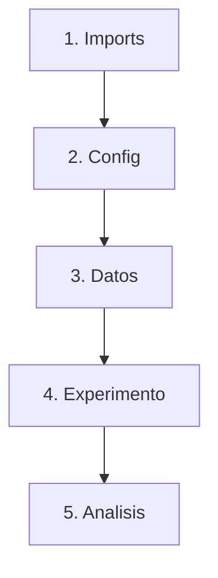

# Jupyter Notebooks

> Los notebooks son el laboratorio del cientifico de datos. El script es la produccion.

**Tipo:** Construir
**Lenguajes:** Python
**Prerrequisitos:** 01-entorno-desarrollo
**Tiempo estimado:** ~45 minutos

## Objetivos de aprendizaje

- Lanzar Jupyter Lab y crear un notebook ejecutable.
- Aplicar la convencion de celdas: imports, configuracion, datos, experimento, analisis.
- Convertir un notebook en un script `.py` reproducible.
- Diagnosticar problemas comunes (kernel muerto, celdas fuera de orden).
- Construir un notebook narrativo que un tercero pueda ejecutar sin instrucciones.

## El problema

Tienes un CSV y quieres entenderlo. Escribes 20 lineas de pandas,
otras 10 de matplotlib, ajustas parametros, vuelves a ejecutar. Eso
es un notebook: una secuencia de celdas que mezcla codigo, salida
y prosa.

Pero los notebooks tienen un lado oscuro:

- Si ejecutas celdas en desorden, los resultados no se pueden reproducir.
- Si guardas el notebook con los outputs, el archivo pesa 100 MB.
- Si lo commiteas a Git, los diffs son ilegibles.

La solucion: una convencion estricta de celdas y una forma de migrar
de notebook a script cuando algo se vuelve definitivo.

## El concepto

Un notebook tiene tres tipos de celda. La convencion del currículo:

1. **Celda 1 — imports**: solo imports, una linea por libreria.
2. **Celda 2 — configuracion**: paths, semillas aleatorias, settings.
3. **Celda 3 — datos**: carga y limpieza, sin transformar.
4. **Celdas 4..N — experimento**: una idea por celda, ejecutable
   independientemente de las anteriores.
5. **Ultima celda — analisis**: comentarios sobre que aprendimos.



Si tu notebook no cabe en este molde, probablemente no es un notebook
sino un script. Conviertelo.

## Constrúyelo

Implementamos un verificador de notebooks en Python: dado un archivo
`.ipynb`, valida la convencion del currículo.

```python
"""
Lección: 05-jupyter-notebooks
Fase: 00
Prerrequisitos: 01-entorno-desarrollo
Fuentes:
- nbformat: https://nbformat.readthedocs.io/
- Jupyter: https://jupyter.org/
"""
from __future__ import annotations

import json
import re
import sys
from pathlib import Path
from typing import Iterable

PRIMERA_CELDA_IMPORTS = {
    "numpy", "pandas", "torch", "matplotlib", "seaborn",
    "sklearn", "scipy", "requests", "json", "Path",
}

PATRON_IMPORT = re.compile(r"^(?:from\s+(\S+)\s+import|import\s+(\S+))")


def cargar_notebook(ruta: Path) -> dict:
    return json.loads(ruta.read_text(encoding="utf-8"))


def obtener_codigo(celda: dict) -> str:
    return "".join(celda.get("source", []))


def validar_estructura(nb: dict) -> list[str]:
    """Devuelve una lista de problemas. Vacia = todo OK."""
    problemas: list[str] = []
    celdas = nb.get("cells", [])
    if not celdas:
        return ["notebook vacio"]
    # Celda 1: imports
    primera = obtener_codigo(celdas[0])
    imports = PATRON_IMPORT.findall(primera)
    if not imports:
        problemas.append("celda 1: no parece tener imports")
    # Celdas de codigo
    codigo = [c for c in celdas if c.get("cell_type") == "code"]
    if not codigo:
        problemas.append("sin celdas de codigo")
    # Buscar semillas aleatorias
    texto_total = "".join(obtener_codigo(c) for c in codigo)
    if "random" in texto_total or "numpy" in texto_total:
        if "seed" not in texto_total and "semilla" not in texto_total.lower():
            problemas.append("usa random/numpy pero no fija semilla")
    return problemas


def contar_palabras_markdown(nb: dict) -> int:
    total = 0
    for c in nb.get("cells", []):
        if c.get("cell_type") == "markdown":
            total += len(" ".join(c.get("source", [])).split())
    return total


def main() -> int:
    if len(sys.argv) < 2:
        print("Uso: python3 main.py <notebook.ipynb>")
        return 1
    ruta = Path(sys.argv[1])
    if not ruta.exists():
        print(f"ERROR: {ruta} no existe")
        return 1
    nb = cargar_notebook(ruta)
    problemas = validar_estructura(nb)
    palabras = contar_palabras_markdown(nb)
    reporte = {
        "archivo": str(ruta),
        "celdas_totales": len(nb.get("cells", [])),
        "palabras_markdown": palabras,
        "problemas": problemas,
    }
    print(json.dumps(reporte, indent=2, ensure_ascii=False))
    return 0 if not problemas else 1


if __name__ == "__main__":
    sys.exit(main())
```

## Úsalo

```bash
# Crear un notebook narrativo con jupyter lab
jupyter lab

# Validar la convencion del currículo
python3 code/main.py mi_experimento.ipynb
```

Para convertir un notebook en script ejecutable:

```bash
jupyter nbconvert --to script mi_experimento.ipynb
python3 mi_experimento.py
```

## Despliégalo

Prompt util cuando un LLM debe generar un notebook desde cero:

```markdown
---
name: prompt-jupyter-narrativo
description: Generar un notebook Jupyter narrativo para analisis exploratorio
fase: 00
leccion: 05
---

Eres un asistente de exploracion de datos. Recibiras un dataset (path
o descripcion) y debes devolver un notebook Jupyter en JSON con la
siguiente estructura de celdas:

1. Celda 1: imports (numpy, pandas, matplotlib, seaborn).
2. Celda 2: configuracion (semillas aleatorias, paths).
3. Celda 3: carga y limpieza.
4. Celdas 4-8: analisis exploratorio (uno por celda, ejecutable).
5. Ultima celda: resumen narrativo en markdown.

Reglas:

- Celdas en orden, ejecutables de arriba abajo.
- Cada celda de codigo tiene un comentario markdown antes explicando que hace.
- Outputs NO se incluyen en el JSON (sera regenerado al ejecutar).
```

## Ejercicios

1. **Validar un notebook existente**: abre cualquier notebook que
   tengas, pasalo por `python3 code/main.py tu_notebook.ipynb` y
   arregla los problemas que reporte.
2. **Convertir y comparar**: convierte un notebook con `nbconvert
   --to script` y compara el resultado con un script escrito a mano.
   Que prefieres?
3. **Desafio**: anade al validador una regla que detecte cuando una
   celda imprime >100 lineas (output potencialmente ruidoso).

## Lecturas recomendadas

- Jupyter docs: <https://jupyter.org/documentation>
- nbformat: <https://nbformat.readthedocs.io/>
- "Ten rules for writing Jupyter notebooks": <https://peerj.com/articles/cs-97/>
- nbconvert: <https://nbconvert.readthedocs.io/>

---

> 📚 **Adaptacion al espanol** de la leccion
> "[Jupyter Notebooks]" del curriculo
> [AI Engineering from Scratch](https://github.com/rohitg00/ai-engineering-from-scratch)
> (Rohit Ghumare, MIT). Implementacion y documentacion reescritas
> desde cero. Ver [CREDITS.md](../../../../CREDITS.md).
