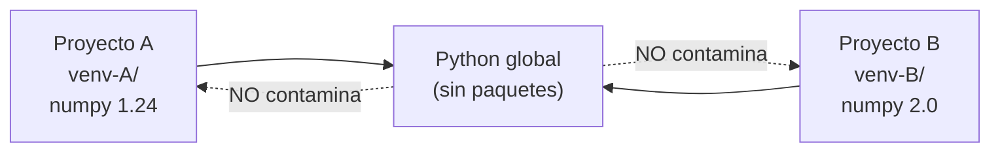

# Entornos virtuales de Python

> Cada proyecto, su propio rincon. Las dependencias de A no deben romper B.

**Tipo:** Construir
**Lenguajes:** Bash
**Prerrequisitos:** 01-entorno-desarrollo
**Tiempo estimado:** ~30 minutos

## Objetivos de aprendizaje

- Crear un entorno virtual con `python -m venv`.
- Activar y desactivar el entorno en macOS, Linux y Windows.
- Instalar dependencias desde `requirements.txt` y `pyproject.toml`.
- Diagnosticar cuando un comando Python usa el interprete equivocado.
- Construir un script de setup que automatice la creacion del entorno.

## El problema

Imagina que el Proyecto A necesita `numpy==1.24` y el Proyecto B
necesita `numpy==2.0`. Si los instalas globalmente, actualizar uno
rompe al otro. La solucion es un **entorno virtual**: un directorio
aislado con su propio Python y sus propias dependencias.



## El concepto

Un entorno virtual es un arbol de directorios con:

- Un enlace simbolico o copia de `python`.
- Un `pip` que solo ve paquetes en `lib/pythonX.Y/site-packages/`.
- Un script `activate` que anade el `bin/` del entorno al PATH.

En el diplomado usaremos **venv** (incluido en Python 3.3+) en lugar
de `virtualenv` o `conda`, por ser el mas portable y no requerir
instalacion extra.

## Constrúyelo

```bash
#!/usr/bin/env bash
# Lección: 06-entornos-python
# Fase: 00
# Prerrequisitos: 01-entorno-desarrollo
# Fuentes:
# - venv: https://docs.python.org/3/library/venv.html
# - pip: https://pip.pypa.io/en/stable/

set -euo pipefail

NOMBRE_ENTORNO="${1:-.venv}"
PYTHON="${PYTHON:-python3}"

uso() {
  cat <<EOF
Uso: $(basename "$0") <comando> [argumentos]

Comandos:
  create           Crea un entorno virtual en $NOMBRE_ENTORNO
  install          Crea el entorno e instala requirements.txt
  check            Verifica que el entorno existe y reporta su estado
  python <args>    Ejecuta Python dentro del entorno
  pip <args>       Ejecuta pip dentro del entorno
  clean            Elimina el entorno
EOF
}

verificar_python() {
  if ! command -v "$PYTHON" >/dev/null 2>&1; then
    echo "ERROR: $PYTHON no esta en PATH"
    return 1
  fi
  local version
  version="$($PYTHON --version 2>&1)"
  echo "OK: $version"
}

crear_entorno() {
  if [ -d "$NOMBRE_ENTORNO" ]; then
    echo "AVISO: $NOMBRE_ENTORNO ya existe, no se recrea"
    return 0
  fi
  verificar_python
  "$PYTHON" -m venv "$NOMBRE_ENTORNO"
  echo "OK: entorno creado en $NOMBRE_ENTORNO"
}

instalar_dependencias() {
  crear_entorno
  if [ ! -f "requirements.txt" ]; then
    echo "AVISO: no hay requirements.txt, nada que instalar"
    return 0
  fi
  "$NOMBRE_ENTORNO/bin/pip" install --upgrade pip >/dev/null
  "$NOMBRE_ENTORNO/bin/pip" install -r requirements.txt
  echo "OK: dependencias instaladas"
}

reporte() {
  if [ ! -d "$NOMBRE_ENTORNO" ]; then
    echo "FALTA: $NOMBRE_ENTORNO no existe"
    return 1
  fi
  local python_venv
  python_venv="$("$NOMBRE_ENTORNO/bin/python" --version 2>&1)"
  local paquetes
  paquetes="$("$NOMBRE_ENTORNO/bin/pip" list 2>/dev/null | wc -l | tr -d ' ')"
  echo "Entorno: $NOMBRE_ENTORNO"
  echo "Python:  $python_venv"
  echo "Paquetes: $paquetes"
}

ejecutar_python() {
  if [ ! -x "$NOMBRE_ENTORNO/bin/python" ]; then
    echo "ERROR: entorno no existe. Ejecuta '$0 create' primero"
    return 1
  fi
  "$NOMBRE_ENTORNO/bin/python" "$@"
}

ejecutar_pip() {
  if [ ! -x "$NOMBRE_ENTORNO/bin/pip" ]; then
    echo "ERROR: entorno no existe"
    return 1
  fi
  "$NOMBRE_ENTORNO/bin/pip" "$@"
}

limpiar() {
  if [ -d "$NOMBRE_ENTORNO" ]; then
    rm -rf "$NOMBRE_ENTORNO"
    echo "OK: $NOMBRE_ENTORNO eliminado"
  else
    echo "AVISO: nada que limpiar"
  fi
}

case "${1:-}" in
  create)  crear_entorno ;;
  install) instalar_dependencias ;;
  check)   reporte ;;
  python)  shift; ejecutar_python "$@" ;;
  pip)     shift; ejecutar_pip "$@" ;;
  clean)   limpiar ;;
  *)       uso ;;
esac
```

## Úsalo

```bash
chmod +x code/main.sh
./code/main.sh create           # crea .venv/
./code/main.sh install          # instala requirements.txt
./code/main.sh check            # estado del entorno
./code/main.sh python -c "import numpy; print(numpy.__version__)"
./code/main.sh pip list         # paquetes instalados
./code/main.sh clean            # elimina el entorno
```

## Despliégalo

Prompt util para que un LLM diagnostique problemas con venv:

```markdown
---
name: prompt-venv-diagnostico
description: Diagnosticar problemas con entornos virtuales de Python
fase: 00
leccion: 06
---

Eres un tecnico de entornos Python. Recibiras el resultado de
`./main.sh check` y tu trabajo:

1. Si el entorno no existe: sugiere `./main.sh create`.
2. Si el Python del entorno no es el esperado: explica como
   cambiar `PYTHON=python3.11 ./main.sh create`.
3. Si pip falla: sugiere borrar el entorno y recrear con `--clear`.
4. Si un paquete no se instala: verifica version de Python
   compatible y dependencias del sistema.
5. Si el usuario tiene problemas con `activate` en su shell,
   recomienda `source .venv/bin/activate` y verificar con `which python`.
```

## Ejercicios

1. **Entorno reproducible**: anade al script un comando `export` que
   genere `requirements-freeze.txt` con todos los paquetes y sus
   versiones exactas. Pista: `pip freeze`.
2. **Multiples Python**: ejecuta el script con
   `PYTHON=python3.11 ./main.sh create` y verifica que el Python
   dentro del entorno es el 3.11.
3. **Desafio**: anade un comando `doctor` que detecte el problema
   clasico: dos entornos apuntando al mismo Python, dependencias
   globales que ensucian el venv, etc.

## Lecturas recomendadas

- venv: <https://docs.python.org/3/library/venv.html>
- pip user guide: <https://pip.pypa.io/en/stable/user_guide/>
- PEP 405 (virtual environments): <https://peps.python.org/pep-0405/>
- pyenv: <https://github.com/pyenv/pyenv>

---

> 📚 **Adaptacion al espanol** de la leccion
> "[Python Environments]" del curriculo
> [AI Engineering from Scratch](https://github.com/rohitg00/ai-engineering-from-scratch)
> (Rohit Ghumare, MIT). Implementacion y documentacion reescritas
> desde cero. Ver [CREDITS.md](../../../../CREDITS.md).
