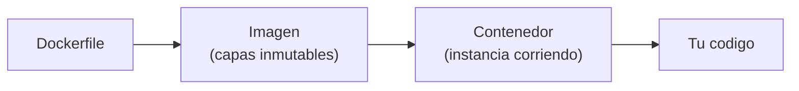

# Docker para IA

> Tu experimento debe correr igual en tu maquina, en el CI y en produccion. Docker es el principio de "funciona en mi maquina" hecho portabilidad.

**Tipo:** Construir
**Lenguajes:** Docker
**Prerrequisitos:** 01-entorno-desarrollo, 06-entornos-python
**Tiempo estimado:** ~60 minutos

## Objetivos de aprendizaje

- Construir un Dockerfile multi-stage que minimice el tamano de la imagen.
- Diferenciar entre imagen y contenedor.
- Montar el codigo como volumen para iterar sin rebuild.
- Diagnosticar problemas comunes: ENTRYPOINT, WORKDIR, COPY, .dockerignore.
- Publicar una imagen a un registry (Docker Hub o GHCR).

## El problema

Tu modelo de IA necesita Python 3.11, PyTorch con CUDA 12.1, ffmpeg,
y 4 GB de dependencias. Si tu amigo o tu servidor de CI tiene
Python 3.9 y CPU, todo se rompe. Docker empaqueta el sistema
operativo, las librerias y tu codigo en una imagen inmutable
que corre igual en cualquier lado.



## El concepto

Una imagen Docker es una pila de capas. Cada instruccion en el
Dockerfile (`FROM`, `RUN`, `COPY`) crea una capa. Docker cachea las
capas: si solo cambia tu codigo, las capas de dependencias se
reutilizan y el rebuild es segundos.

La convencion del currículo:

- **Multi-stage** para reducir tamano: builder + runtime.
- **Usuario no-root** en runtime por seguridad.
- **WORKDIR** explicito, no `cd` encadenados.
- **CMD** con la firma `["python", "main.py"]` (no shell form).

## Constrúyelo

```dockerfile
# Lección: 07-docker-para-ia
# Fase: 00
# Prerrequisitos: 01-entorno-desarrollo, 06-entornos-python
# Fuentes:
# - Docker docs: https://docs.docker.com/reference/dockerfile/
# - Best practices: https://docs.docker.com/build/building/best-practices/

# Stage 1: builder
FROM python:3.12-slim AS builder

WORKDIR /build

# Copiar requirements primero para cachear
COPY requirements.txt .
RUN pip install --no-cache-dir --prefix=/install -r requirements.txt

# Stage 2: runtime
FROM python:3.12-slim AS runtime

# Usuario no-root
RUN useradd --create-home --shell /bin/bash app
WORKDIR /app

# Copiar dependencias instaladas desde el builder
COPY --from=builder /install /usr/local

# Copiar codigo
COPY --chown=app:app code/ /app/code/

USER app

# Default: mostrar version
CMD ["python", "code/main.py", "--version"]
```

## Úsalo

Construir y ejecutar la imagen:

```bash
cd code
docker build -t mi-app-ia:latest .
docker run --rm mi-app-ia:latest
```

Iterar sin rebuild: monta el codigo como volumen:

```bash
docker run --rm -v "$PWD/code":/app/code mi-app-ia:latest \
    python /app/code/main.py
```

Publicar a Docker Hub:

```bash
docker tag mi-app-ia:latest usuario/mi-app-ia:0.1.0
docker push usuario/mi-app-ia:0.1.0
```

## Despliégalo

Prompt para que un LLM genere un Dockerfile optimo para tu proyecto:

```markdown
---
name: prompt-dockerfile-ia
description: Generar un Dockerfile multi-stage para un proyecto de IA
fase: 00
leccion: 07
---

Eres un experto en Docker. Recibiras una descripcion del proyecto
(modelo, framework, dependencias) y debes generar un Dockerfile
multi-stage que:

1. Use una imagen base slim (python:3.12-slim).
2. Separe el stage builder del runtime para minimizar tamano.
3. Cree un usuario no-root para el runtime.
4. Tenga WORKDIR explicito.
5. Use la forma exec de CMD, no shell.
6. Copie requirements.txt antes que el codigo para aprovechar cache.
7. No incluya archivos listados en .dockerignore comun (.git, .venv,
   __pycache__, *.pyc, .env, datasets/, outputs/, .ipynb_checkpoints).

Devuelve:

- El Dockerfile completo.
- El .dockerignore recomendado.
- El comando docker build con tags.
- El comando docker run con volumen para desarrollo.
```

## Ejercicios

1. **Contraste de tamano**: construye un Dockerfile "naive" con
   `FROM ubuntu` y todo en una sola capa. Mide el tamano con
   `docker images`. Compáralo con el multi-stage de la leccion.
2. **Layer cache**: modifica una linea de `code/main.py` y reconstruye.
   Observa cuantos steps se cachean. Pista: `docker build` muestra
   "CACHED" en cada capa reutilizada.
3. **Desafio**: anade un stage "dev" que monte el codigo como
   volumen y tenga instaladas las herramientas de desarrollo
   (pytest, ipython, black). Compáralo con el stage runtime.

## Lecturas recomendadas

- Dockerfile reference: <https://docs.docker.com/reference/dockerfile/>
- Best practices: <https://docs.docker.com/build/building/best-practices/>
- Multi-stage builds: <https://docs.docker.com/build/building/multi-stage/>
- Docker Hub: <https://hub.docker.com/>
- GitHub Container Registry: <https://docs.github.com/en/packages/working-with-a-github-packages-registry/working-with-the-container-registry>

---

> 📚 **Adaptacion al espanol** de la leccion
> "[Docker for AI]" del curriculo
> [AI Engineering from Scratch](https://github.com/rohitg00/ai-engineering-from-scratch)
> (Rohit Ghumare, MIT). Implementacion y documentacion reescritas
> desde cero. Ver [CREDITS.md](../../../../CREDITS.md).
