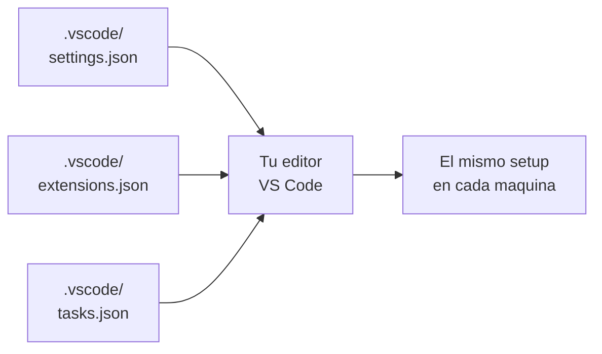

# Configuracion del editor (VS Code)

> Un buen setup del editor te ahorra 30 minutos al dia. Un mal setup te cuesta lo mismo, todos los dias.

**Tipo:** Construir
**Lenguajes:** Python
**Prerrequisitos:** 01-entorno-desarrollo
**Tiempo estimado:** ~30 minutos

## Objetivos de aprendizaje

- Identificar las extensiones esenciales para Python, IA y Git en VS Code.
- Configurar `settings.json` con formato estricto, linter y formateador.
- Definir tareas (`tasks.json`) para correr tests, linter y verificar entorno.
- Diagnosticar problemas comunes: linter no corre, formateador no aplica, terminal equivocado.
- Compartir la configuracion del equipo via `.vscode/` commiteado.

## El problema

VS Code arranca con defaults genericos. Para un proyecto de IA
necesitas:

- **Python extension** (linting, intellisense, debugging).
- **Pylance** o **Ruff** como servidor de lenguaje.
- **Black** o **Ruff** como formateador.
- **Jupyter** para notebooks.
- **GitLens** o **Git Graph** para visualizar historia.
- **Docker** para la fase 0+.

Esta configuracion debe ser reproducible. Si la defines via la UI,
tu companero no la tiene. La respuesta: `.vscode/settings.json` y
`.vscode/extensions.json` commiteados al repo.



## El concepto

VS Code lee tres archivos en `.vscode/`:

1. `settings.json` — preferencias del editor.
2. `extensions.json` — extensiones recomendadas.
3. `tasks.json` — tareas automatizadas (build, test, lint).

El primero controla como se ve y comporta el editor. El segundo le
dice a VS Code "cuando abras este proyecto, ofrece instalar estas
extensiones". El tercero define comandos invocables desde
`Terminal > Run Task` o atajos de teclado.

## Constrúyelo

Implementamos un verificador que valida la sintaxis y las claves
recomendadas de los tres archivos.

```python
"""
Lección: 08-configuracion-editor
Fase: 00
Prerrequisitos: 01-entorno-desarrollo
Fuentes:
- VS Code settings: https://code.visualstudio.com/docs/getstarted/settings
- VS Code extensions: https://code.visualstudio.com/docs/editor/extension-marketplace
"""
from __future__ import annotations

import json
import sys
from pathlib import Path

CLAVES_RECOMENDADAS = {
    "settings": [
        "python.defaultInterpreterPath",
        "python.testing.pytestEnabled",
        "editor.formatOnSave",
        "[python]": "objeto con editor.defaultFormatter",
    ],
    "extensions": [
        "ms-python.python",
        "ms-python.vscode-pylance",
        "ms-toolsai.datawrangler",
    ],
}

EXTENSIONES_RECOMENDADAS = {
    "ms-python.python": "Python",
    "ms-python.vscode-pylance": "Pylance",
    "ms-toolsai.jupyter": "Jupyter",
    "ms-toolsai.vscode-jupyter": "Jupyter Notebooks",
    "ms-azuretools.vscode-docker": "Docker",
    "eamodio.gitlens": "GitLens",
}


def cargar_json(ruta: Path) -> dict:
    return json.loads(ruta.read_text(encoding="utf-8"))


def validar_settings(datos: dict) -> list[str]:
    problemas: list[str] = []
    if "python.defaultInterpreterPath" not in datos:
        problemas.append("Falta 'python.defaultInterpreterPath'")
    if not datos.get("editor.formatOnSave", False):
        problemas.append("editor.formatOnSave no esta habilitado")
    if "[python]" in datos and "editor.defaultFormatter" in datos["[python]"]:
        return problemas
    problemas.append("Falta [python].editor.defaultFormatter")
    return problemas


def validar_extensions(datos: dict) -> list[str]:
    problemas: list[str] = []
    recomendaciones = datos.get("recommendations", [])
    for ext_id in ("ms-python.python", "ms-python.vscode-pylance"):
        if ext_id not in recomendaciones:
            problemas.append(f"Falta extension recomendada: {ext_id}")
    return problemas


def verificar_directorio(vscode: Path) -> dict:
    reporte: dict = {
        "settings_ok": True,
        "extensions_ok": True,
        "problemas": [],
    }
    settings = vscode / "settings.json"
    extensions = vscode / "extensions.json"
    if settings.exists():
        try:
            datos = cargar_json(settings)
            for p in validar_settings(datos):
                reporte["problemas"].append(f"settings: {p}")
                reporte["settings_ok"] = False
        except json.JSONDecodeError as exc:
            reporte["problemas"].append(f"settings: JSON invalido: {exc}")
            reporte["settings_ok"] = False
    else:
        reporte["problemas"].append("no existe settings.json")
        reporte["settings_ok"] = False
    if extensions.exists():
        try:
            datos = cargar_json(extensions)
            for p in validar_extensions(datos):
                reporte["problemas"].append(f"extensions: {p}")
                reporte["extensions_ok"] = False
        except json.JSONDecodeError as exc:
            reporte["problemas"].append(f"extensions: JSON invalido: {exc}")
            reporte["extensions_ok"] = False
    else:
        reporte["problemas"].append("no existe extensions.json")
        reporte["extensions_ok"] = False
    return reporte


def main() -> int:
    vscode = Path(".vscode")
    if not vscode.exists():
        print(f"AVISO: {vscode} no existe; crea los archivos ahi")
        return 1
    reporte = verificar_directorio(vscode)
    print(json.dumps(reporte, indent=2, ensure_ascii=False))
    return 0 if not reporte["problemas"] else 1


if __name__ == "__main__":
    sys.exit(main())
```

## Úsalo

Crea los archivos en `.vscode/`:

```bash
mkdir -p .vscode
```

Escribe `.vscode/settings.json`:

```json
{
  "python.defaultInterpreterPath": "${workspaceFolder}/.venv/bin/python",
  "editor.formatOnSave": true,
  "[python]": {
    "editor.defaultFormatter": "ms-python.black-formatter"
  },
  "python.testing.pytestEnabled": true
}
```

Escribe `.vscode/extensions.json`:

```json
{
  "recommendations": [
    "ms-python.python",
    "ms-python.vscode-pylance",
    "ms-toolsai.jupyter",
    "ms-azuretools.vscode-docker",
    "eamodio.gitlens"
  ]
}
```

Verifica con el script de la leccion:

```bash
python3 code/main.py
```

## Despliégalo

Prompt para que un LLM sugiera la configuracion optima segun tu stack:

```markdown
---
name: prompt-vscode-config-ia
description: Sugerir configuracion de VS Code para un proyecto de IA
fase: 00
leccion: 08
---

Eres un experto en VS Code para proyectos de IA. Recibiras una
descripcion del stack (Python, framework, linter, formateador) y
devuelves los tres archivos .vscode/ listos para commitear:

1. settings.json con python.defaultInterpreterPath apuntando a .venv,
   formatOnSave, linter configurado.
2. extensions.json con extensiones esenciales para el stack.
3. tasks.json con tres tareas: test, lint, format.

Reglas:

- No incluyas claves que no conozcas con certeza.
- Sugiere Pylance como servidor de lenguaje.
- Sugiere Ruff si el formateador no es Black.
- No commitees secretos en settings.
```

## Ejercicios

1. **Configurar tasks.json**: crea `.vscode/tasks.json` con una tarea
   `test` que ejecute `python -m pytest`. Disparala desde
   `Terminal > Run Task`.
2. **Debug launch.json**: crea `.vscode/launch.json` con una
   configuracion de debug para `main.py` de cualquier leccion.
3. **Desafio**: anade al verificador un modo `--strict` que falle
   si falta cualquier extension de la lista completa, no solo las
   obligatorias.

## Lecturas recomendadas

- VS Code User and Workspace Settings: <https://code.visualstudio.com/docs/getstarted/settings>
- Extension recommendations: <https://code.visualstudio.com/docs/editor/extension-marketplace>
- Tasks: <https://code.visualstudio.com/docs/editor/tasks>
- Python extension: <https://marketplace.visualstudio.com/items?itemName=ms-python.python>
- Ruff: <https://docs.astral.sh/ruff/>

---

> 📚 **Adaptacion al espanol** de la leccion
> "[Editor Setup]" del curriculo
> [AI Engineering from Scratch](https://github.com/rohitg00/ai-engineering-from-scratch)
> (Rohit Ghumare, MIT). Implementacion y documentacion reescritas
> desde cero. Ver [CREDITS.md](../../../../CREDITS.md).
