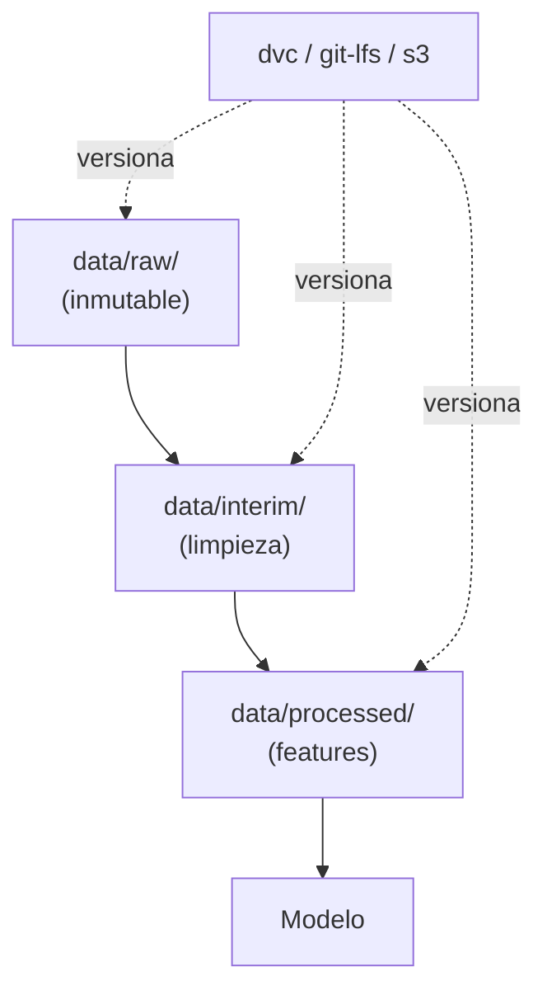

# Gestion de datos

> Un buen dataset bien versionado vale mas que un modelo complejo con datos a medias.

**Tipo:** Construir
**Lenguajes:** Python
**Prerrequisitos:** 01-entorno-desarrollo, 02-git-colaboracion
**Tiempo estimado:** ~45 minutos

## Objetivos de aprendizaje

- Implementar carga de CSV/JSON/Parquet con buenas practicas.
- Versionar datasets con DVC o por convencion de directorios.
- Diagnosticar problemas de tipos, valores faltantes y encoding.
- Generar un manifesto de dataset (schema, hash, fecha, filas).
- Separar datos crudos de datos limpios en la estructura del proyecto.

## El problema

Tienes un CSV de 2 GB. Lo commiteas. Git se vuelve inutil. Tu
companero lo clona y tarda 20 minutos. Ademas, nadie sabe si el
archivo es de ayer o de hace seis meses.

La gestion de datos para ML no es lo mismo que para una app web.
Necesitamos:

- **Inmutabilidad**: los datos crudos no se tocan.
- **Trazabilidad**: cualquier cambio queda registrado.
- **Reproducibilidad**: el modelo de hoy usa los mismos datos
  que el de ayer si quiero comparar.
- **Documentacion**: schema, origen, fecha, hash.

## El concepto



Tres directorios canonicos:

- `raw/`: original, jamas modificado.
- `interim/`: transformaciones intermedias.
- `processed/`: listo para entrenar.

DVC (Data Version Control) guarda el hash del dataset en Git y el
contenido en S3/GCS/local. Alternativa simple: guardar hash y
metadatos en un archivo `manifest.json`.

## Constrúyelo

Implementamos un gestor de datasets minimo: carga un CSV, valida
el schema, calcula hash SHA256 y genera un manifesto.

```python
"""
Lección: 09-gestion-de-datos
Fase: 00
Prerrequisitos: 01-entorno-desarrollo, 02-git-colaboracion
Fuentes:
- DVC: https://dvc.org/doc
- hashlib: https://docs.python.org/3/library/hashlib.html
- csv: https://docs.python.org/3/library/csv.html
"""
from __future__ import annotations

import csv
import hashlib
import json
import sys
from pathlib import Path


def sha256_archivo(ruta: Path) -> str:
    h = hashlib.sha256()
    with ruta.open("rb") as f:
        for chunk in iter(lambda: f.read(65536), b""):
            h.update(chunk)
    return h.hexdigest()


def cargar_csv(ruta: Path) -> tuple[list[str], list[list[str]]]:
    with ruta.open(encoding="utf-8", newline="") as f:
        reader = csv.reader(f)
        cabecera = next(reader, [])
        filas = list(reader)
    return cabecera, filas


def validar_no_vacio(cabecera: list[str], filas: list[list[str]]) -> list[str]:
    problemas: list[str] = []
    if not cabecera:
        problemas.append("CSV sin cabecera")
    if not filas:
        problemas.append("CSV sin filas")
    for i, fila in enumerate(filas):
        if len(fila) != len(cabecera):
            problemas.append(f"fila {i}: {len(fila)} columnas != {len(cabecera)}")
            if len(problemas) > 10:
                problemas.append("demasiados errores, abortando")
                break
    return problemas


def generar_manifiesto(ruta: Path) -> dict:
    cabecera, filas = cargar_csv(ruta)
    return {
        "archivo": str(ruta),
        "hash_sha256": sha256_archivo(ruta),
        "tamano_bytes": ruta.stat().st_size,
        "filas": len(filas),
        "columnas": cabecera,
    }


def main() -> int:
    if len(sys.argv) < 2:
        print("Uso: python3 main.py <dataset.csv>")
        return 1
    ruta = Path(sys.argv[1])
    if not ruta.exists():
        print(f"ERROR: {ruta} no existe")
        return 1
    cabecera, filas = cargar_csv(ruta)
    problemas = validar_no_vacio(cabecera, filas)
    if problemas:
        print("Problemas:", *problemas, sep="\n  - ")
        return 1
    manifiesto = generar_manifiesto(ruta)
    print(json.dumps(manifiesto, indent=2, ensure_ascii=False))
    return 0


if __name__ == "__main__":
    sys.exit(main())
```

## Úsalo

```bash
python3 code/main.py datasets/mi_dataset.csv > datasets/mi_dataset.manifest.json
```

El manifesto es tu prueba de version: cualquier byte cambiado
cambia el hash, y puedes comparar manifiestos entre runs.

## Despliégalo

Prompt para que un LLM diagnostique problemas de datos:

```markdown
---
name: prompt-datos-diagnostico
description: Diagnosticar problemas con un dataset CSV/Parquet
fase: 00
leccion: 09
---

Eres un tecnico de datos. Recibiras el manifesto JSON y un reporte
de validacion de un CSV. Tu trabajo:

1. Detecta schema drift (columnas cambiantes entre versiones).
2. Detecta valores faltantes por columna.
3. Detecta tipos inconsistentes (un campo "edad" con strings).
4. Sugiere la estructura de directorios data/raw, data/interim,
   data/processed.
5. Recomienda DVC si el dataset pesa >10 MB.
```

## Ejercicios

1. **Validacion de schema**: anade al validador una verificacion
   de tipos por columna (int, float, str) con una declaracion
   esperada.
2. **Reporte de nulos**: cuenta nulos por columna y anadelos al
   manifiesto.
3. **Desafio**: integra DVC en el flujo: en lugar de escribir el
   manifiesto a mano, llama a `dvc add` y `dvc push` desde Python.

## Lecturas recomendadas

- DVC: <https://dvc.org/doc>
- Cookiecutter Data Science: <https://drivendata.github.io/cookiecutter-data-science/>
- Pandas IO: <https://pandas.pydata.org/docs/user_guide/io.html>
- hashlib: <https://docs.python.org/3/library/hashlib.html>

---

> 📚 **Adaptacion al espanol** de la leccion
> "[Data Management]" del curriculo
> [AI Engineering from Scratch](https://github.com/rohitg00/ai-engineering-from-scratch)
> (Rohit Ghumare, MIT). Implementacion y documentacion reescritas
> desde cero. Ver [CREDITS.md](../../../../CREDITS.md).
