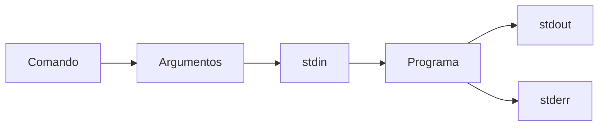

# Terminal y shell

> Casi todo el flujo de trabajo en ingenieria de IA pasa por una terminal. Aprender bien tu shell te separa del 90% que copia y pega.

**Tipo:** Aprender
**Lenguajes:** Bash
**Prerrequisitos:** 01-entorno-desarrollo
**Tiempo estimado:** ~30 minutos

## Objetivos de aprendizaje

- Navegar el filesystem con `cd`, `ls`, `pwd` de forma fluida.
- Construir pipelines con `|`, redirecciones `>` y `<`, `>>`.
- Iterar con `for`, `while`, `if` en scripts Bash.
- Diagnosticar permisos, paths y variables de entorno.
- Configurar tu `.bashrc` / `.zshrc` con aliases utiles.

## El problema

La terminal es la interfaz universal de la ingenieria. Todo lo que
haces con un clic en una UI tiene un equivalente en linea de
comandos. Si dependes de la UI, dependes de que alguien construya
la UI para lo que necesitas.

Ademas, los servidores no tienen UI. Cuando entrenas un modelo en
un servidor remoto, la terminal es todo lo que tienes.

## El concepto

Un shell lee comandos y los ejecuta. Hay tres tipos:

- **sh (Bourne shell)**: el mas antiguo, presente en todo Unix.
- **bash (Bourne Again shell)**: el default en Linux.
- **zsh (Z shell)**: el default en macOS moderno.

Los tres comparten la sintaxis basica (`cd`, `ls`, `|`). Las
diferencias estan en completitud, expansion y plugins.



Tres streams: `stdin` (entrada), `stdout` (salida), `stderr` (errores).
Los pipelines conectan `stdout` de uno a `stdin` del siguiente.

## Constrúyelo

Un script con los 12 comandos mas utiles para el flujo de IA.

```bash
#!/usr/bin/env bash
# Lección: 10-terminal-y-shell
# Fase: 00
# Prerrequisitos: 01-entorno-desarrollo
# Fuentes:
# - Bash manual: https://www.gnu.org/software/bash/manual/
# - ShellCheck: https://www.shellcheck.net/

set -euo pipefail

uso() {
  cat <<EOF
Uso: $(basename "$0") <comando> [args]

Comandos:
  info               Muestra info del shell actual
  count-words <f>    Cuenta lineas y palabras de un archivo
  find-py <dir>      Encuentra archivos .py en un directorio
  count-todos <dir>  Cuenta TODOs en archivos .py
  tail-log <f>       Imprime las ultimas 10 lineas de un log
  env-python         Muestra info del Python en PATH
  diff-size <a> <b>  Compara tamano de dos archivos
  snippet <f>        Imprime lineas 1-10 de un archivo
  json-pretty <f>    Pretty-print de un JSON
  find-large <dir>   Lista archivos > 10MB en un directorio
  random-id          Genera un identificador aleatorio
  fecha              Fecha actual en formato ISO
EOF
}

info() {
  echo "Shell: ${SHELL:-desconocido}"
  echo "Bash: ${BASH_VERSION:-no es bash}"
  echo "Usuario: ${USER:-desconocido}"
  echo "PWD: ${PWD:-desconocido}"
}

count_words() {
  local archivo="${1:-}"
  if [ -z "$archivo" ] || [ ! -f "$archivo" ]; then
    echo "ERROR: archivo no valido"
    return 1
  fi
  local lineas palabras
  lineas=$(wc -l < "$archivo" | tr -d ' ')
  palabras=$(wc -w < "$archivo" | tr -d ' ')
  echo "Lineas: $lineas, Palabras: $palabras"
}

find_py() {
  local dir="${1:-.}"
  find "$dir" -name "*.py" -type f 2>/dev/null | head -20
}

count_todos() {
  local dir="${1:-.}"
  grep -rn "TODO\|FIXME" --include="*.py" "$dir" 2>/dev/null | wc -l | tr -d ' '
}

tail_log() {
  local archivo="${1:-}"
  [ -f "$archivo" ] && tail -10 "$archivo"
}

env_python() {
  command -v python3 || echo "python3 no en PATH"
  python3 --version 2>&1 || true
}

diff_size() {
  [ $# -eq 2 ] || { echo "ERROR: necesita 2 archivos"; return 1; }
  local s1 s2
  s1=$(stat -f%z "$1" 2>/dev/null || stat -c%s "$1" 2>/dev/null)
  s2=$(stat -f%z "$2" 2>/dev/null || stat -c%s "$2" 2>/dev/null)
  echo "$1: $s1 bytes, $2: $s2 bytes"
}

snippet() {
  head -10 "${1:-}"
}

json_pretty() {
  python3 -m json.tool < "${1:-/dev/stdin}"
}

find_large() {
  local dir="${1:-.}"
  find "$dir" -type f -size +10M 2>/dev/null | head -10
}

random_id() {
  cat /dev/urandom | head -c 8 | od -An -tx1 | tr -d ' \n'
  echo
}

fecha() {
  date -u +"%Y-%m-%dT%H:%M:%SZ"
}

case "${1:-}" in
  info) info ;;
  count-words) shift; count_words "$@" ;;
  find-py) shift; find_py "$@" ;;
  count-todos) shift; count_todos "$@" ;;
  tail-log) shift; tail_log "$@" ;;
  env-python) env_python ;;
  diff-size) shift; diff_size "$@" ;;
  snippet) shift; snippet "$@" ;;
  json-pretty) shift; json_pretty "$@" ;;
  find-large) shift; find_large "$@" ;;
  random-id) random_id ;;
  fecha) fecha ;;
  *) uso ;;
esac
```

## Úsalo

```bash
chmod +x code/main.sh
./code/main.sh info
./code/main.sh count-words README.md
./code/main.sh find-py code
./code/main.sh random-id
./code/main.sh fecha
```

## Despliégalo

Prompt para diagnosticar comportamiento inesperado en un script:

```markdown
---
name: prompt-shell-diagnostico
description: Diagnosticar errores en scripts de Bash
fase: 00
leccion: 10
---

Eres un experto en Bash. Recibiras un script con problemas y un
mensaje de error. Tu trabajo:

1. Identifica la causa raiz (variable no definida, permisos,
   quoting, sub-shell, glob).
2. Sugiere el cambio minimo que lo arregla.
3. Recomienda habilitar `set -euo pipefail` si no esta.
4. Si el error es de quoting, muestra la diferencia entre "weak"
   y 'strong'.
5. No reescribas el script completo; cambia solo la linea necesaria.
```

## Ejercicios

1. **Pipeline de archivos grandes**: combina `find`, `xargs`, `wc`
   y `sort` para listar los 10 archivos `.py` mas largos del repo.
2. **Variables de entorno**: en una sola linea, exporta
   `MI_VAR=hola`, ejecuta otro comando, y verifica con `env | grep MI_VAR`.
3. **Desafio**: convierte el script para que acepte un argumento
   `--json` que devuelva la salida en formato JSON en vez de texto.

## Lecturas recomendadas

- Bash manual: <https://www.gnu.org/software/bash/manual/>
- ShellCheck: <https://www.shellcheck.net/>
- "The Art of Command Line": <https://github.com/jlevy/the-art-of-command-line>
- explain shell: <https://explainshell.com/>

---

> 📚 **Adaptacion al espanol** de la leccion
> "[Terminal and Shell]" del curriculo
> [AI Engineering from Scratch](https://github.com/rohitg00/ai-engineering-from-scratch)
> (Rohit Ghumare, MIT). Implementacion y documentacion reescritas
> desde cero. Ver [CREDITS.md](../../../../CREDITS.md).
