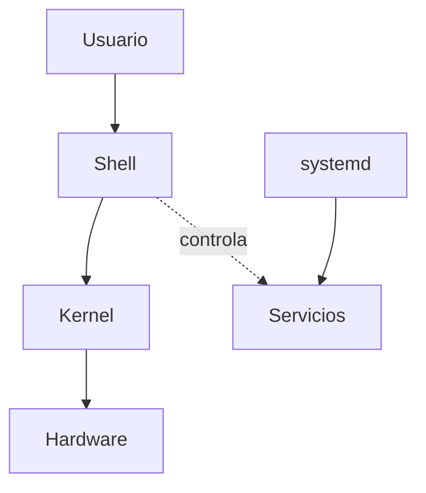

# Linux para IA

> Los servidores de IA son Linux. Si no te sientes comodo en Linux, cada deploy sera una pelea.

**Tipo:** Aprender
**Lenguajes:** Bash
**Prerrequisitos:** 01-entorno-desarrollo, 10-terminal-y-shell
**Tiempo estimado:** ~30 minutos

## Objetivos de aprendizaje

- Diagnosticar usuarios, grupos y permisos con `id`, `chmod`, `chown`.
- Inspeccionar procesos con `ps`, `top`, `htop`, `kill`.
- Leer logs del sistema con `journalctl` y `dmesg`.
- Configurar servicios con `systemd`.
- Diagnosticar problemas de red con `ss`, `netstat`, `curl`, `ping`.

## El problema

Tu modelo entrena en una maquina con Ubuntu, tu laptop es macOS y
el cluster es CentOS. Los tres son Unix-like, pero los paths,
paquetes y servicios difieren. Si no entiendes la capa comun, vas
a perder horas debuggeando lo basico.

## El concepto



- **Usuario**: cada quien corre con sus propios permisos.
- **Shell**: el comando que ejecutas.
- **Kernel**: el nucleo que habla con el hardware.
- **systemd**: el gestor de servicios (corre `nginx`, `postgres`, etc.).
- **Logs**: el registro de que paso. En `journalctl` o `/var/log/`.

## Constrúyelo

Un script que diagnostica los 5 problemas mas comunes en servidores
de IA.

```bash
#!/usr/bin/env bash
# Lección: 11-linux-para-ia
# Fase: 00
# Prerrequisitos: 01-entorno-desarrollo, 10-terminal-y-shell
# Fuentes:
# - systemd: https://www.freedesktop.org/software/systemd/man/systemd.html
# - ss(8): https://man7.org/linux/man-pages/man8/ss.8.html

set -euo pipefail

uso() {
  cat <<EOF
Uso: $(basename "$0") <comando>

Comandos:
  who             Quien soy y a que grupos pertenezco
  resources       CPU, RAM, disco disponible
  top-processes   Top 5 procesos por uso de CPU
  listening       Puertos TCP abiertos
  os-info         Info del sistema operativo
EOF
}

quien() {
  echo "Usuario: $(id -un)"
  echo "UID:     $(id -u)"
  echo "Grupos:  $(id -Gn)"
  echo "Home:    $HOME"
}

recursos() {
  echo "== CPU =="
  if command -v nproc >/dev/null 2>&1; then
    nproc
  else
    sysctl -n hw.ncpu 2>/dev/null || echo "?"
  fi
  echo ""
  echo "== Memoria =="
  if [ -f /proc/meminfo ]; then
    grep -E "MemTotal|MemAvailable|MemFree" /proc/meminfo | head -3
  else
    vm_stat | head -5
  fi
  echo ""
  echo "== Disco =="
  df -h / 2>/dev/null | head -3
}

top_procesos() {
  if [ -f /proc/loadavg ]; then
    echo "Load average: $(cut -d' ' -f1-3 /proc/loadavg)"
  fi
  ps -eo pid,user,pcpu,pmem,comm --sort=-pcpu 2>/dev/null | head -6
}

puertos_abiertos() {
  if command -v ss >/dev/null 2>&1; then
    ss -tln 2>/dev/null | head -10
  elif command -v netstat >/dev/null 2>&1; then
    netstat -tln 2>/dev/null | head -10
  elif command -v lsof >/dev/null 2>&1; then
    lsof -nP -iTCP -sTCP:LISTEN 2>/dev/null | head -10
  else
    echo "Ninguna herramienta de puertos disponible"
  fi
}

os_info() {
  if [ -f /etc/os-release ]; then
    . /etc/os-release
    echo "SO:     $NAME $VERSION"
  elif command -v sw_vers >/dev/null 2>&1; then
    sw_vers
  else
    uname -a
  fi
  echo "Kernel: $(uname -r)"
  echo "Arch:  $(uname -m)"
}

case "${1:-}" in
  who) quien ;;
  resources) recursos ;;
  top-processes) top_procesos ;;
  listening) puertos_abiertos ;;
  os-info) os_info ;;
  *) uso ;;
esac
```

## Úsalo

```bash
chmod +x code/main.sh
./code/main.sh who
./code/main.sh resources
./code/main.sh os-info
```

## Despliégalo

Prompt para diagnosticar problemas en un servidor Linux:

```markdown
---
name: prompt-linux-diagnostico
description: Diagnosticar problemas comunes en servidores Linux para IA
fase: 00
leccion: 11
---

Eres un administrador Linux. Recibiras la salida de uno o mas
comandos (ps, df, ss, dmesg, journalctl) y debes:

1. Identificar la causa raiz del problema reportado.
2. Proponer el comando exacto para mitigarlo (sin pasos extras).
3. Si es un servicio caido, sugerir `systemctl restart <servicio>`.
4. Si es disco lleno, listar los 5 directorios mas grandes con
   `du -sh /var/* | sort -rh | head`.
5. Si es OOM (out of memory), recomendar reducir el tamano del
   batch o usar `dmesg | grep -i oom` para confirmar.

Reglas:

- No asumas la distribucion; detecta desde /etc/os-release.
- Siempre sugiere verificar logs primero, actuar despues.
```

## Ejercicios

1. **Permisos**: crea un archivo `secreto.txt` con permisos 600
   (solo el dueno puede leer). Verifica con `ls -l`.
2. **Servicio**: en una maquina con systemd, ejecuta
   `systemctl status ssh` y analiza el output.
3. **Desafio**: anade al script un comando `memory-hogs` que liste
   los 5 procesos que mas RAM consumen, ordenados de mayor a menor.

## Lecturas recomendadas

- systemd: <https://www.freedesktop.org/software/systemd/man/systemd.html>
- Linux Performance: <https://www.brendangregg.com/linuxperf.html>
- ss(8): <https://man7.org/linux/man-pages/man8/ss.8.html>
- explain shell: <https://explainshell.com/>
- TLDR pages: <https://tldr.sh/>

---

> 📚 **Adaptacion al espanol** de la leccion
> "[Linux for AI]" del curriculo
> [AI Engineering from Scratch](https://github.com/rohitg00/ai-engineering-from-scratch)
> (Rohit Ghumare, MIT). Implementacion y documentacion reescritas
> desde cero. Ver [CREDITS.md](../../../../CREDITS.md).
