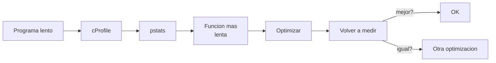

# Depuracion y profiling

> Un programa lento es un programa que no entiendes. Perfila antes de optimizar.

**Tipo:** Construir
**Lenguajes:** Python
**Prerrequisitos:** 01-entorno-desarrollo, 10-terminal-y-shell
**Tiempo estimado:** ~60 minutos

## Objetivos de aprendizaje

- Depurar paso a paso con `pdb` y breakpoints condicionales.
- Medir tiempos con `timeit` y `cProfile`.
- Identificar cuellos de botella con `cProfile.run` y `pstats`.
- Diagnosticar fugas de memoria con `tracemalloc`.
- Construir un micro-benchmark repetible.

## El problema

Tienes un script que tarda 30 segundos. No sabes por que. Si
optimizas a ciegas, perderas dos horas y el script seguira
tardando 28 segundos. La unica forma inteligente es **medir
primero**, identificar la linea lenta, optimizarla, y volver a
medir.



## El concepto

Hay tres tipos de medicion:

- **Micro-benchmarks** (`timeit`): una sola operacion.
- **Perfilado** (`cProfile`): que funciones consumen mas tiempo.
- **Memoria** (`tracemalloc`): donde se asigna mas memoria.

`pdb` es el depurador interactivo de la biblioteca estandar. No
requiere instalacion. Sus comandos clave:

- `n` (next): ejecuta la siguiente linea.
- `s` (step): entra en la funcion llamada.
- `c` (continue): hasta el siguiente breakpoint.
- `p expr`: imprime el valor de la expresion.
- `b linea`: pone un breakpoint.

## Constrúyelo

Implementamos un micro-benchmark + perfilador para una funcion
intencionalmente lenta, y un debugger con breakpoints condicionales.

```python
"""
Lección: 12-depuracion-y-profiling
Fase: 00
Prerrequisitos: 01-entorno-desarrollo, 10-terminal-y-shell
Fuentes:
- pdb: https://docs.python.org/3/library/pdb.html
- cProfile: https://docs.python.org/3/library/profile.html
- timeit: https://docs.python.org/3/library/timeit.html
- tracemalloc: https://docs.python.org/3/library/tracemalloc.html
"""
from __future__ import annotations

import argparse
import cProfile
import io
import pdb
import pstats
import sys
import timeit
import tracemalloc


def funcion_lenta(n: int) -> int:
    """Calcula la suma de los primeros n numeros, pero en O(n^2) en
    lugar de O(n) para que el perfilado la encuentre como cuello de
    botella. Sirve como banco de pruebas para el debugger."""
    total = 0
    for i in range(n):
        for j in range(n):
            total += i + j
    return total


def version_rapida(n: int) -> int:
    return n * (n - 1)


def micro_benchmark(n: int, repeticiones: int = 5) -> dict:
    tiempo_lenta = timeit.timeit(lambda: funcion_lenta(n), number=repeticiones)
    tiempo_rapida = timeit.timeit(lambda: version_rapida(n), number=repeticiones)
    return {
        "n": n,
        "repeticiones": repeticiones,
        "lenta_s": tiempo_lenta,
        "rapida_s": tiempo_rapida,
        "speedup": tiempo_lenta / tiempo_rapida if tiempo_rapida > 0 else 0,
    }


def perfilar(n: int, top: int = 5) -> str:
    pr = cProfile.Profile()
    pr.enable()
    funcion_lenta(n)
    pr.disable()
    buf = io.StringIO()
    stats = pstats.Stats(pr, stream=buf).sort_stats("cumulative")
    stats.print_stats(top)
    return buf.getvalue()


def memoria(n: int) -> dict:
    tracemalloc.start()
    funcion_lenta(n)
    actual, pico = tracemalloc.get_traced_memory()
    tracemalloc.stop()
    return {
        "bytes_actual": actual,
        "bytes_pico": pico,
        "kb_pico": pico / 1024,
    }


def depurar(n: int) -> str:
    """Ejecuta la funcion bajo pdb con un breakpoint en la linea 25.
    Captura el trace de ejecucion."""
    buf = io.StringIO()
    class StringIOPdb(pdb.Pdb):
        def __init__(self):
            super().__init__(stdout=buf, stdin=io.StringIO("c\n"))
    StringIOPdb().run("funcion_lenta(1)", globals={"funcion_lenta": funcion_lenta})
    return buf.getvalue()


def main() -> int:
    parser = argparse.ArgumentParser(description="Demo 12-depuracion-y-profiling")
    parser.add_argument("--n", type=int, default=100, help="Tamano del benchmark")
    parser.add_argument(
        "--modo",
        choices=["benchmark", "profile", "memory", "debug"],
        default="benchmark",
    )
    args = parser.parse_args()
    if args.modo == "benchmark":
        import json
        print(json.dumps(micro_benchmark(args.n), indent=2))
    elif args.modo == "profile":
        print(perfilar(args.n))
    elif args.modo == "memory":
        import json
        print(json.dumps(memoria(args.n), indent=2))
    elif args.modo == "debug":
        print(depurar(args.n))
    return 0


if __name__ == "__main__":
    sys.exit(main())
```

## Úsalo

```bash
cd code
python3 main.py --modo benchmark --n 100
python3 main.py --modo profile --n 100
python3 main.py --modo memory --n 100
python3 main.py --modo debug
```

Para depurar interactivamente cualquier script, agrega un breakpoint
en el codigo:

```python
import pdb; pdb.set_trace()
```

O mas limpio, con `breakpoint()` (Python 3.7+):

```python
breakpoint()
```

## Despliégalo

Prompt para que un LLM sugiera optimizaciones basadas en un perfil:

```markdown
---
name: prompt-perfil-optimizacion
description: Sugerir optimizaciones a partir de un perfil de cProfile
fase: 00
leccion: 12
---

Eres un experto en optimizacion de Python. Recibiras la salida de
cProfile + pstats y debes:

1. Identificar la funcion que consume mas tiempo cumulado.
2. Estimar la complejidad algoritmica (O(n), O(n^2), etc.).
3. Proponer una alternativa mas eficiente (numpy, dict en vez de
   list, algoritmo O(n log n), etc.).
4. Advertir si la optimizacion propuesta no es valida (ej. cambiar
   un algoritmo O(n^2) por uno O(n) que no resuelve el mismo
   problema).
5. Sugerir pruebas de regresion (mismos inputs, comparar outputs
   exactos).
```

## Ejercicios

1. **Micro-benchmark**: compara `list.append` vs `list.insert(0, x)`
   para 1000 elementos. Predice el resultado antes de ejecutar.
2. **cProfile**: corre el script de la leccion y observa que
   `funcion_lenta` consume todo el tiempo. Cambia el codigo para
   usar la version rapida y mide de nuevo.
3. **tracemalloc**: ejecuta con `--modo memory --n 1000` y observa
   el pico de memoria. Cambia el codigo a la version rapida y
   mide de nuevo (deberia ser minimo).

## Lecturas recomendadas

- pdb: <https://docs.python.org/3/library/pdb.html>
- cProfile: <https://docs.python.org/3/library/profile.html>
- timeit: <https://docs.python.org/3/library/timeit.html>
- tracemalloc: <https://docs.python.org/3/library/tracemalloc.html>
- "High Performance Python" (Gorelick & Ozsvald): <https://www.oreilly.com/library/view/high-performance-python/9781492055013/>

---

> 📚 **Adaptacion al espanol** de la leccion
> "[Debugging and Profiling]" del curriculo
> [AI Engineering from Scratch](https://github.com/rohitg00/ai-engineering-from-scratch)
> (Rohit Ghumare, MIT). Implementacion y documentacion reescritas
> desde cero. Ver [CREDITS.md](../../../../CREDITS.md).
