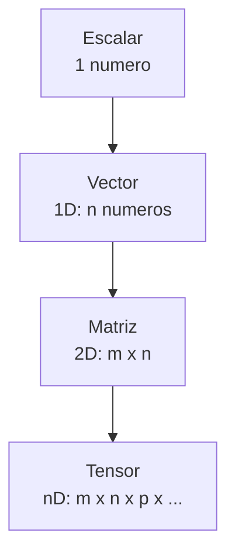

# Intuicion de algebra lineal

> Algebra lineal es el lenguaje de los datos. Un pixel es un vector; una imagen es una matriz; una capa de red neuronal es una multiplicacion de matrices.

**Tipo:** Aprender
**Lenguajes:** Python
**Prerrequisitos:** 00-configuracion-y-herramientas
**Tiempo estimado:** ~45 minutos

## Objetivos de aprendizaje

- Visualizar vectores y matrices como objetos geometricos.
- Entender las cuatro operaciones basicas: suma, escalar, producto, transpuesta.
- Distinguir entre espacio vectorial, subespacio y combinacion lineal.
- Implementar las operaciones desde cero con NumPy.
- Diagnosticar errores de dimensiones en operaciones matriciales.

## El problema

Cada vez que tu modelo recibe un batch de 32 imagenes de 224x224 pixeles en RGB, eso es un tensor de forma `(32, 224, 224, 3)`. Las capas de la red hacen multiplicaciones de matrices sobre ese tensor. Si no entiendes que es una multiplicacion de matrices, no puedes entender por que tu red aprende o por que explota con NaN.

## El concepto

Tres objetos fundamentales:



- **Escalar**: un solo numero.
- **Vector**: una secuencia ordenada de numeros. Tiene magnitud y direccion.
- **Matriz**: una tabla rectangular de numeros. Una imagen en escala de grises es una matriz `H x W`.
- **Tensor**: generalizacion a n dimensiones. Un video es un tensor `T x H x W x C`.

Cuatro operaciones que veras todo el tiempo:

| Operacion | Notacion | Resultado |
|---|---|---|
| Suma | `A + B` | Elemento a elemento |
| Escalar | `αA` | Cada elemento multiplicado por α |
| Producto | `A @ B` | Combinacion lineal de filas y columnas |
| Transpuesta | `A^T` | Filas y columnas intercambiadas |

## Constrúyelo

Implementamos las cuatro operaciones desde cero para entender
que hace NumPy internamente.

```python
"""
Lección: 01-intuicion-algebra-lineal
Fase: 01
Prerrequisitos: 00-configuracion-y-herramientas
Fuentes:
- NumPy: https://numpy.org/doc/stable/
- 3Blue1Brown "Essence of Linear Algebra": https://www.3blue1brown.com/topics/linear-algebra
"""
from __future__ import annotations

import numpy as np


def sumar(A: np.ndarray, B: np.ndarray) -> np.ndarray:
    if A.shape != B.shape:
        raise ValueError(f"Formas incompatibles: {A.shape} vs {B.shape}")
    return A + B


def escalar(alpha: float, A: np.ndarray) -> np.ndarray:
    return alpha * A


def transponer(A: np.ndarray) -> np.ndarray:
    return A.T


def multiplicar(A: np.ndarray, B: np.ndarray) -> np.ndarray:
    """Multiplicacion de matrices A (m x n) por B (n x p) -> (m x p)."""
    if A.ndim != 2 or B.ndim != 2:
        raise ValueError("Ambos deben ser matrices 2D")
    if A.shape[1] != B.shape[0]:
        raise ValueError(f"Dimensiones incompatibles: {A.shape} @ {B.shape}")
    m, n = A.shape
    p = B.shape[1]
    C = np.zeros((m, p))
    for i in range(m):
        for j in range(p):
            C[i, j] = sum(A[i, k] * B[k, j] for k in range(n))
    return C


def norma(v: np.ndarray) -> float:
    """Magnitud euclidiana: raiz cuadrada de la suma de cuadrados."""
    return float(np.sqrt(np.sum(v ** 2)))


def producto_punto(a: np.ndarray, b: np.ndarray) -> float:
    """Proyeccion de a sobre b."""
    if a.shape != b.shape:
        raise ValueError("Vectores deben tener la misma forma")
    return float(np.sum(a * b))


def main() -> int:
    A = np.array([[1.0, 2.0], [3.0, 4.0]])
    B = np.array([[5.0, 6.0], [7.0, 8.0]])
    print("A =\n", A)
    print("B =\n", B)
    print("A + B =\n", sumar(A, B))
    print("3 * A =\n", escalar(3.0, A))
    print("A @ B (manual) =\n", multiplicar(A, B))
    print("A @ B (numpy)   =\n", A @ B)
    print("A^T =\n", transponer(A))
    v = np.array([3.0, 4.0])
    print(f"||v|| = {norma(v)}")
    return 0


if __name__ == "__main__":
    import sys
    sys.exit(main())
```

## Úsalo

```bash
cd code
python3 main.py
```

Veras que la multiplicacion manual y la de NumPy dan el mismo
resultado. NumPy usa implementaciones optimizadas en C, pero la
formula es la misma.

## Despliégalo

Prompt para que un LLM diagnostique errores de dimensiones:

```markdown
---
name: prompt-algebra-error-dimensiones
description: Diagnosticar errores de dimensiones en operaciones matriciales
fase: 01
leccion: 01
---

Eres un tutor de algebra lineal aplicada. Recibiras un error de
NumPy o PyTorch del tipo "shapes X and Y not aligned" o "matmul:
shapes mismatch". Tu trabajo:

1. Identificar las formas involucradas.
2. Explicar geometricamente por que no son compatibles.
3. Proponer la transposicion, reshape o broadcast necesario.
4. Si la operacion es entre tensores de mas de 2D, especificar
   que dimensiones se estan multiplicando.
5. Dar el codigo corregido minimo.

Reglas:

- No asumas la intencion del codigo; pregunta si no es claro.
- Si el error menciona broadcasting, explica las reglas de
  NumPy: las dimensiones se alinean a la derecha y se expanden
  si una de ellas es 1.
```

## Ejercicios

1. **Multiplica vectores**: implementa `producto_punto` y compara
   con `np.dot`. Verifica con vectores `a = [1, 2, 3]`, `b = [4, 5, 6]`.
2. **Verifica la transpuesta**: comprueba que `(A @ B)^T == B^T @ A^T`
   para tres matrices aleatorias.
3. **Desafio**: implementa la matriz identidad y comprueba que
   `I @ A == A` para cualquier A.

## Lecturas recomendadas

- 3Blue1Brown "Essence of Linear Algebra":
  <https://www.3blue1brown.com/topics/linear-algebra>
- "Mathematics for Machine Learning" (Deisenroth et al.):
  <https://mml-book.github.io/>
- NumPy quickstart: <https://numpy.org/doc/stable/user/quickstart.html>
- "The Matrix Cookbook":
  <https://www.math.uwaterloo.ca/~hwolkowi/matrixcookbook.pdf>

---

> 📚 **Adaptacion al espanol** de la leccion
> "[Linear Algebra Intuition]" del curriculo
> [AI Engineering from Scratch](https://github.com/rohitg00/ai-engineering-from-scratch)
> (Rohit Ghumare, MIT). Implementacion y documentacion reescritas
> desde cero. Ver [CREDITS.md](../../../../CREDITS.md).
