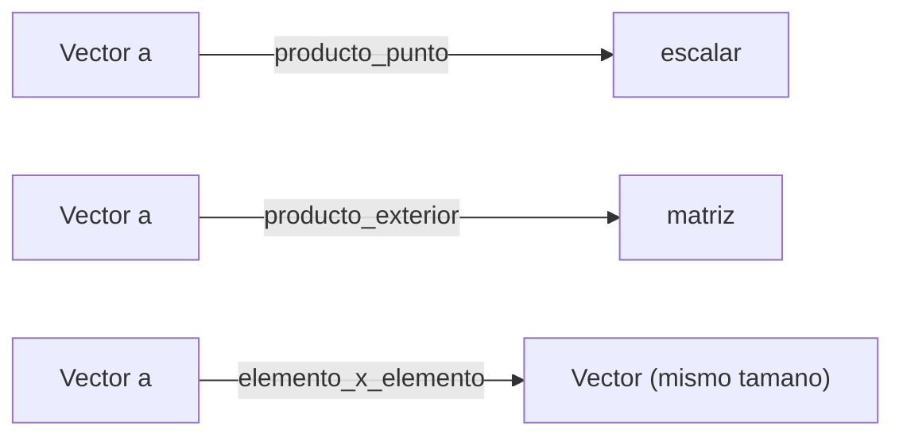

# Vectores, matrices y operaciones

> Vectores, matrices y tensores son los bloques con los que construimos todo en IA. Conocer las operaciones basicas es prerequisito para backprop y atencion.

**Tipo:** Construir
**Lenguajes:** Python
**Prerrequisitos:** 01-intuicion-algebra-lineal
**Tiempo estimado:** ~45 minutos

## Objetivos de aprendizaje

- Distinguir entre producto punto, producto exterior y producto Hadamard.
- Implementar operaciones vectoriales con NumPy desde cero.
- Verificar propiedades: asociatividad, distributividad, no-conmutatividad.
- Diagnosticar errores de broadcasting y shapes.

## El problema

La capa de atencion en un Transformer multiplica queries, keys y
values usando estas operaciones:

- `Q @ K^T` — producto matricial.
- `softmax(QK^T / sqrt(d))` — operaciones elemento a elemento.
- `attn @ V` — otro producto matricial.

Si no entiendes estas operaciones, el codigo del Transformer es
caja negra. Esta leccion te da la intuicion geometrica.

## El concepto



Tres productos importantes:

| Producto | Entradas | Salida | Uso en ML |
|---|---|---|---|
| Punto | `a (n,), b (n,)` | escalar | Similitud coseno, scores |
| Exterior | `a (m,), b (n,)` | matriz `(m, n)` | Embeddings bilineales |
| Hadamard | `a (n,), b (n,)` | vector `(n,)` | Gating, attention masks |

## Constrúyelo

```python
"""
Lección: 02-vectores-matrices-operaciones
Fase: 01
Prerrequisitos: 01-intuicion-algebra-lineal
Fuentes:
- NumPy: https://numpy.org/doc/stable/
- "Matrix Cookbook": https://www.math.uwaterloo.ca/~hwolkowi/matrixcookbook.pdf
"""
from __future__ import annotations

import sys
from typing import Tuple

import numpy as np


def producto_punto(a: np.ndarray, b: np.ndarray) -> float:
    if a.shape != b.shape:
        raise ValueError("Vectores deben tener la misma forma")
    return float(np.sum(a * b))


def producto_exterior(a: np.ndarray, b: np.ndarray) -> np.ndarray:
    return np.outer(a, b)


def producto_hadamard(a: np.ndarray, b: np.ndarray) -> np.ndarray:
    if a.shape != b.shape:
        raise ValueError("Vectores deben tener la misma forma")
    return a * b


def norma_l2(v: np.ndarray) -> float:
    return float(np.sqrt(np.sum(v ** 2)))


def coseno(a: np.ndarray, b: np.ndarray) -> float:
    """Similitud coseno: 1 = identicos, 0 = ortogonales, -1 = opuestos."""
    na = norma_l2(a)
    nb = norma_l2(b)
    if na == 0 or nb == 0:
        return 0.0
    return producto_punto(a, b) / (na * nb)


def verificar_propiedades() -> dict:
    a = np.array([1.0, 2.0, 3.0])
    b = np.array([4.0, 5.0, 6.0])
    c = np.array([7.0, 8.0, 9.0])
    resultados = {}
    # Asociatividad: (a.b).c == a.(b.c)
    resultados["asociatividad_punto"] = np.isclose(
        producto_punto(producto_punto(a, b) * np.ones(3), c),
        producto_punto(a, producto_punto(b, c) * np.ones(3)),
    )
    # Distributividad: a.(b+c) == a.b + a.c
    resultados["distributividad"] = np.isclose(
        producto_punto(a, b + c),
        producto_punto(a, b) + producto_punto(a, c),
    )
    # No conmutatividad del producto matricial
    A = np.array([[1.0, 2.0], [3.0, 4.0]])
    B = np.array([[5.0, 6.0], [7.0, 8.0]])
    resultados["matmul_no_conmutativo"] = not np.allclose(A @ B, B @ A)
    return resultados


def main() -> int:
    a = np.array([1.0, 2.0, 3.0])
    b = np.array([4.0, 5.0, 6.0])
    print("a =", a)
    print("b =", b)
    print("a . b =", producto_punto(a, b))
    print("a ⊗ b (outer) =\n", producto_exterior(a, b))
    print("a ⊙ b (hadamard) =", producto_hadamard(a, b))
    print("cos(a, b) =", coseno(a, b))
    print("\nPropiedades:", verificar_propiedades())
    return 0


if __name__ == "__main__":
    sys.exit(main())
```

## Úsalo

```bash
cd code
python3 main.py
```

## Despliégalo

Prompt para que un LLM diagnostique errores de operaciones vectoriales:

```markdown
---
name: prompt-vectores-error
description: Diagnosticar errores en operaciones vectoriales y matriciales
fase: 01
leccion: 02
---

Eres un tutor de algebra lineal. Recibiras un fragmento de codigo
con NumPy/PyTorch/TensorFlow y un error. Tu trabajo:

1. Identificar la operacion involucrada (producto punto, externo,
   Hadamard, broadcasting).
2. Explicar la incompatibilidad de shapes.
3. Proponer la correccion minima.
4. Si hay un bug sutil (e.g. promedio vs suma en una dimension),
   senalarlo.

Reglas:

- Cita la linea exacta a cambiar.
- Si recomiendas reshape, explica la nueva forma.
```

## Ejercicios

1. **Similitud coseno**: implementa una funcion que recibe una
   matriz `(N, D)` y un vector `(D,)` y devuelve las similitudes
   coseno con cada fila.
2. **Broadcasting**: que hace `np.array([1, 2, 3]) + np.array([[10], [20]])`?
   Predice, ejecuta, explica.
3. **Desafio**: implementa la capa de atencion escalada
   `softmax(QK^T / sqrt(d_k)) @ V` desde cero.

## Lecturas recomendadas

- NumPy broadcasting: <https://numpy.org/doc/stable/user/basics.broadcasting.html>
- "The Matrix Cookbook": <https://www.math.uwaterloo.ca/~hwolkowi/matrixcookbook.pdf>
- 3Blue1Brown: <https://www.3blue1brown.com/topics/linear-algebra>

---

> 📚 **Adaptacion al espanol** de la leccion "[Vectors, Matrices and Operations]" del curriculo [AI Engineering from Scratch](https://github.com/rohitg00/ai-engineering-from-scratch) (Rohit Ghumare, MIT). Implementacion y documentacion reescritas desde cero. Ver [CREDITS.md](../../../../CREDITS.md).
