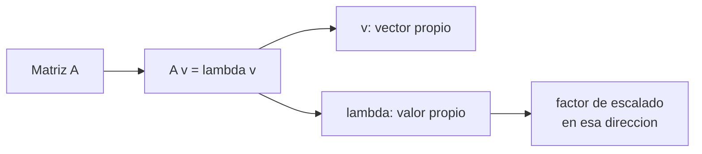

# Transformaciones y valores propios

> Una matriz es una transformacion del espacio. Los valores propios te dicen cuanto se estira cada direccion.

**Tipo:** Construir
**Lenguajes:** Python
**Prerrequisitos:** 01-intuicion-algebra-lineal
**Tiempo estimado:** ~45 minutos

## Objetivos de aprendizaje

- Interpretar una matriz como transformacion geometrica.
- Construir matrices de rotacion, escalado y proyeccion.
- Calcular valores y vectores propios con NumPy.
- Diagonalizar matrices simetricas.
- Aplicar PCA como caso de uso de valores propios.

## El problema

La matriz de covarianza de tus datos es simetrica. Sus vectores
propios son las **direcciones de maxima varianza**. Eso es PCA:
una proyeccion sobre los primeros k vectores propios preserva
la mayor parte de la informacion.

Si no entiendes que es un vector propio, PCA es caja negra.
Con esta leccion, entiendes la mecanica.

## El concepto



Definicion: `v` es vector propio de `A` si aplicarle `A` solo
cambia su magnitud, no su direccion:

```text
A v = lambda v
```

donde `lambda` es un escalar (el valor propio).

Geometricamente: aplicar `A` estira el vector `v` por factor
`lambda` y nada mas.

## Constrúyelo

```python
"""
Lección: 03-transformaciones-valores-propios
Fase: 01
Prerrequisitos: 01-intuicion-algebra-lineal
Fuentes:
- NumPy linalg: https://numpy.org/doc/stable/reference/routines.linalg.html
- 3Blue1Brown: https://www.3blue1brown.com/topics/linear-algebra
"""
from __future__ import annotations

import sys
import numpy as np


def matriz_rotacion(theta: float) -> np.ndarray:
    c, s = np.cos(theta), np.sin(theta)
    return np.array([[c, -s], [s, c]])


def matriz_escalado(sx: float, sy: float) -> np.ndarray:
    return np.array([[sx, 0.0], [0.0, sy]])


def aplicar_transformacion(T: np.ndarray, v: np.ndarray) -> np.ndarray:
    return T @ v


def valores_propios(A: np.ndarray) -> tuple[np.ndarray, np.ndarray]:
    return np.linalg.eig(A)


def verificar_vpropios(A: np.ndarray, tol: float = 1e-9) -> bool:
    autovalores, autovectores = valores_propios(A)
    for i in range(A.shape[0]):
        v = autovectores[:, i]
        lam = autovalores[i]
        residual = np.linalg.norm(A @ v - lam * v)
        if residual > tol:
            return False
    return True


def diagonalizar(A: np.ndarray) -> tuple[np.ndarray, np.ndarray, np.ndarray]:
    autovalores, P = valores_propios(A)
    D = np.diag(autovalores.astype(float))
    P_inv = np.linalg.inv(P)
    return P, D, P_inv


def main() -> int:
    R = matriz_rotacion(np.pi / 4)
    v = np.array([1.0, 0.0])
    print("R =\n", R)
    print("v =", v)
    print("R @ v =", aplicar_transformacion(R, v))
    A = np.array([[2.0, 1.0], [1.0, 2.0]])
    autovalores, autovectores = valores_propios(A)
    print("A =\n", A)
    print("autovalores =", autovalores)
    print("A v = lambda v?", verificar_vpropios(A))
    return 0


if __name__ == "__main__":
    sys.exit(main())
```

## Úsalo

```bash
cd code
python3 main.py
```

## Despliégalo

```markdown
---
name: prompt-eigen-stability
description: Diagnosticar problemas numericos con valores propios
fase: 01
leccion: 03
---

Eres un tutor de algebra lineal. Recibiras el output de
`numpy.linalg.eig` o `eigh` y debes:

1. Verificar que los vectores propios satisfacen A v = lambda v.
2. Advertir si la matriz es casi-singular (autovalor ~ 0).
3. Si los autovalores son complejos, explicar que la matriz
   no es simetrica.
4. Para matrices grandes (>1000x1000), recomendar eigh con
   shift-and-invert o usar scipy.sparse.linalg.

Reglas:
- Sugiere precondicionar si hay problemas de condicionamiento.
- Si hay un autovalor negativo, no asumas que es bug; podria
  ser real (e.g. matriz de inertia con momento negativo).
```

## Ejercicios

1. **PCA manual**: calcula los valores propios de la matriz de
   covarianza de 100 puntos aleatorios 2D. Verifica que el
   autovalor mas grande corresponde a la direccion de maxima
   varianza.
2. **Diagonalizacion**: para A = [[2,1],[1,2]], verifica que
   P D P^-1 = A.
3. **Desafio**: implementa la descomposicion SVD
   `A = U S V^T` desde cero usando valores propios de A^T A.

## Lecturas recomendadas

- 3Blue1Brown: <https://www.3blue1brown.com/topics/linear-algebra>
- "Mathematics for Machine Learning" cap. 4: <https://mml-book.github.io/>
- NumPy linalg: <https://numpy.org/doc/stable/reference/routines.linalg.html>

---

> 📚 **Adaptacion al espanol** de la leccion "[Matrix Transformations]" del curriculo [AI Engineering from Scratch](https://github.com/rohitg00/ai-engineering-from-scratch) (Rohit Ghumare, MIT). Implementacion y documentacion reescritas desde cero. Ver [CREDITS.md](../../../../CREDITS.md).
