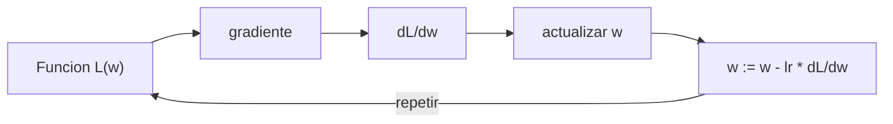

# Cálculo para ML: derivadas y gradientes

> El entrenamiento de redes neuronales es descenso por gradiente. Sin entender derivadas, eso es magia.

**Tipo:** Construir
**Lenguajes:** Python
**Prerrequisitos:** 01-intuicion-algebra-lineal
**Tiempo estimado:** ~30 minutos

## Objetivos de aprendizaje

- Derivar polinomios simbolicamente.
- Aproximar derivadas numericamente con diferencias centrales.
- Implementar descenso por gradiente en R^n.
- Diagnosticar tasas de aprendizaje y convergencia.

## El problema

Entrenar un modelo es: encontrar los pesos `w` que minimizan la
perdida `L(w)`. La regla de actualizacion es:

```text
w := w - lr * gradiente(L, w)
```

Esto es descenso por gradiente. Si no entiendes derivadas, el
entrenamiento es caja negra.

## El concepto



- **Derivada**: tasa de cambio instantanea de una funcion.
- **Gradiente**: vector de derivadas parciales; apunta en la
  direccion de mayor crecimiento.
- **lr (learning rate)**: cuanto nos movemos en direccion contraria
  al gradiente.

## Constrúyelo

```python
"""
Lección: 04-calculo-para-ml
Fase: 01
Prerrequisitos: 01-intuicion-algebra-lineal
Fuentes:
- sympy: https://docs.sympy.org/
- 3Blue1Brown Calculus: https://www.3blue1brown.com/topics/calculus
"""
from __future__ import annotations

import sys


def derivada_polinomio(coefs: list[float]) -> list[float]:
    return [coefs[i] * i for i in range(1, len(coefs))]


def evaluar_polinomio(coefs: list[float], x: float) -> float:
    return sum(c * (x ** i) for i, c in enumerate(coefs))


def derivada_numerica(f, x: float, h: float = 1e-7) -> float:
    return (f(x + h) - f(x - h)) / (2 * h)


def gradiente(f, vars_inicial: list[float], h: float = 1e-5,
              max_iter: int = 100, lr: float = 0.1) -> list[float]:
    vars_act = list(vars_inicial)
    for _ in range(max_iter):
        grad = []
        for i in range(len(vars_act)):
            pm = list(vars_act); pm[i] += h
            pn = list(vars_act); pn[i] -= h
            grad.append((f(*pm) - f(*pn)) / (2 * h))
        vars_act = [v - lr * g for v, g in zip(vars_act, grad)]
    return vars_act


def main() -> int:
    f = lambda x: 3 * x ** 2 + 2 * x + 1
    print(f"f'(2) exacta = {6 * 2 + 2}")
    print(f"f'(2) numerica = {derivada_numerica(f, 2.0)}")
    g = lambda x, y: (x - 1) ** 2 + (y + 2) ** 2
    minimo = gradiente(g, [0.0, 0.0])
    print(f"Minimo numerico: {minimo}")
    return 0


if __name__ == "__main__":
    sys.exit(main())
```

## Úsalo

```bash
cd code
python3 main.py
```

## Despliégalo

```markdown
---
name: prompt-gradiente-tuning
description: Diagnosticar problemas de convergencia en descenso por gradiente
fase: 01
leccion: 04
---

Eres un tutor de optimizacion. Recibiras un reporte de
entrenamiento (perdida por iteracion, learning rate, etc.) y debes:

1. Diagnosticar si diverge, oscila, o converge lento.
2. Si diverge, recomendar reducir lr a la mitad.
3. Si oscila, recomendar momentum o ajustar schedule.
4. Si converge lento, sugerir lr mas grande o mejor inicializacion.
5. Si se atasca en minimo local, recomendar reiniciar o usar SGD.

Reglas:
- Siempre grafica mentalmente la trayectoria: lr grande = saltos,
  lr pequeno = pasos pequenos.
- Si la perdida es NaN, lo primero es reducir lr, no cambiar
  optimizador.
```

## Ejercicios

1. **Polinomio cubico**: deriva x^3 + 2x^2 - x + 5. Verifica evaluando
   la derivada en x=1.
2. **Seno y coseno**: confirma que la derivada numerica de sin(x) en
   x=0 es aproximadamente 1 (=cos(0)).
3. **Desafio**: implementa descenso por gradiente con momentum
   `v := beta * v + grad; w := w - lr * v`.

## Lecturas recomendadas

- 3Blue1Brown Calculus: <https://www.3blue1brown.com/topics/calculus>
- "Calculus" (Stewart): libro de texto clasico
- SymPy: <https://docs.sympy.org/>

---

> 📚 **Adaptación al español** de la lección "[Calculus for ML]" del currículo [AI Engineering from Scratch](https://github.com/rohitg00/ai-engineering-from-scratch) (Rohit Ghumare, MIT). Implementación y documentación reescritas desde cero. Ver [CREDITS.md](../../../../CREDITS.md).
