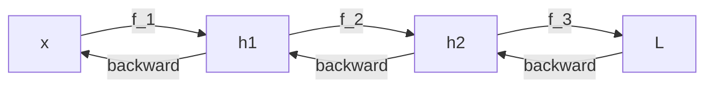

# Regla de la cadena y autodiff

> Backpropagation es la regla de la cadena aplicada a una composicion gigante de operaciones. Entender la cadena es entender backprop.

**Tipo:** Construir
**Lenguajes:** Python
**Prerrequisitos:** 04-calculo-para-ml
**Tiempo estimado:** ~45 minutos

## Objetivos de aprendizaje

- Aplicar la regla de la cadena a composiciones de funciones.
- Verificar gradientes numericamente contra PyTorch autograd.
- Diagnosticar por que un gradiente es 0 o NaN.
- Implementar mini-autodiff con tapiz de gradientes.

## El problema

Tu red neuronal es una composicion de 1000 operaciones:
`f = f_1000 o f_999 o ... o f_1`. Para entrenarla, necesitas el
gradiente de L respecto a cada peso. Si calculas cada derivada
a mano, son millones.

La regla de la cadena dice:

```text
dL/dw = dL/df * df/dh * dh/dg * ... * df_1/dw
```

Es decir, multiplicas las derivadas locales. Eso es backprop.

## El concepto



En PyTorch, autograd hace esto por ti: cada operacion registra
sus derivadas locales y backward propaga el gradiente via la cadena.

## Constrúyelo

```python
"""
Lección: 05-regla-de-la-cadena-y-autodiff
Fase: 01
Prerrequisitos: 04-calculo-para-ml
Fuentes:
- PyTorch autograd: https://pytorch.org/docs/stable/autograd.html
- "Calculus on Computational Graphs" (Baydin et al., 2018)
"""
from __future__ import annotations

import sys
from typing import Callable

try:
    import torch
    HAS_TORCH = True
except ImportError:
    HAS_TORCH = False


def derivada_cadena(composicion, x):
    if not composicion:
        return 1.0
    valor = x
    derivadas = []
    for f in composicion:
        h = 1e-7
        derivadas.append((f(valor + h) - f(valor - h)) / (2 * h))
        valor = f(valor)
    resultado = 1.0
    for d in derivadas:
        resultado *= d
    return resultado


def grad_check(f, x_inicial, h=1e-5):
    grad = []
    for i in range(len(x_inicial)):
        pm = list(x_inicial); pm[i] += h
        pn = list(x_inicial); pn[i] -= h
        grad.append((f(*pm) - f(*pn)) / (2 * h))
    return grad


def main() -> int:
    f1 = lambda x: x ** 2
    f2 = lambda x: 2 * x + 1
    print(f"f(3) = {f2(f1(3.0))}")
    print(f"f'(3) exacta = {4 * 3}")
    print(f"f'(3) via cadena = {derivada_cadena([f1, f2], 3.0)}")
    if HAS_TORCH:
        x = torch.tensor([5.0], requires_grad=True)
        y = (x - 3) ** 2
        y.backward()
        print(f"PyTorch: df/dx en x=5 es {x.grad.item()} (esperado 4)")
    return 0


if __name__ == "__main__":
    sys.exit(main())
```

## Úsalo

```bash
cd code
python3 main.py
```

## Despliégalo

```markdown
---
name: prompt-autograd-debug
description: Diagnosticar gradientes 0 o NaN en PyTorch / TensorFlow
fase: 01
leccion: 05
---

Eres un tutor de autodiff. Recibiras un reporte de entrenamiento
donde loss = NaN o gradientes = 0. Tu trabajo:

1. Si el gradiente es exactamente 0, sospechar ReLU muerto o
   desconexion del grafo.
2. Si el gradiente es NaN, sospechar division por cero, log(0)
   o learning rate muy alto.
3. Recomendar torch.autograd.gradcheck para verificar la
   implementacion custom contra gradientes numericos.
4. Si el modelo no aprende y los gradientes son pequenos, sugerir
   revisar inicializacion y normalizacion.

Reglas:
- Siempre mencionar la posibilidad de desconectar el grafo
  con .detach() o torch.no_grad().
- Si hay embeddings, verificar que el embedding no este congelado.
```

## Ejercicios

1. **Verificacion numerica**: implementa f(x) = exp(sin(x^2)) y
   verifica que el gradiente numerico y el de PyTorch coinciden.
2. **Composicion larga**: implementa una red neuronal de 3 capas
   con PyTorch y verifica que la suma de gradientes antes y despues
   del backward es igual a 0.
3. **Desafio**: implementa un mini-autodiff con un Tapiz (clase
   que guarda valor y gradiente, soporta + y *) desde cero.

## Lecturas recomendadas

- PyTorch autograd: <https://pytorch.org/docs/stable/autograd.html>
- "Automatic Differentiation in PyTorch" (Baydin et al., 2018)
- Karpathy "Spelled-out intro to neural networks": <https://karpathy.ai/zero-to-hero.html>

---

> 📚 **Adaptación al español** de la lección "[Chain Rule and Autodiff]" del currículo [AI Engineering from Scratch](https://github.com/rohitg00/ai-engineering-from-scratch) (Rohit Ghumare, MIT). Implementación y documentación reescritas desde cero. Ver [CREDITS.md](../../../../CREDITS.md).
