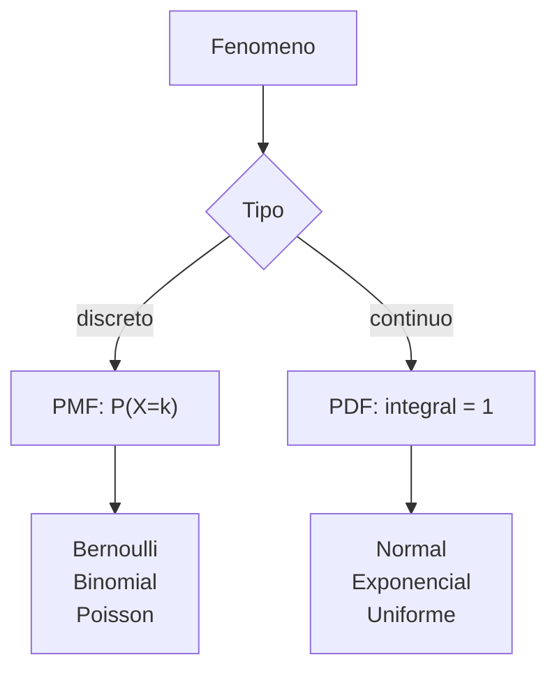

# Probabilidad y distribuciones

> La mayoria de los algoritmos de ML son probabilidad con esteroides. Entender Bernoulli, Normal y Binomial es prerequisito.

**Tipo:** Aprender
**Lenguajes:** Python
**Prerrequisitos:** 01-intuicion-algebra-lineal
**Tiempo estimado:** ~30 minutos

## Objetivos de aprendizaje

- Distinguir entre PMF (discreta) y PDF (continua).
- Implementar las distribuciones mas comunes: Bernoulli, Binomial, Normal.
- Estimar parametros por maxima verosimilitud.
- Diagnosticar que distribucion modela mejor un fenomeno.

## El problema

Tienes datos de clicks en un anuncio. Quieres modelar la
probabilidad de que un usuario haga click. Eso es un Bernoulli.
Si cuentas clicks en 100 usuarios, es Binomial. Si mides el tiempo
entre clicks, es Exponencial. Cada fenomeno tiene su distribucion.

Si usas la distribucion equivocada, tu modelo subajusta.

## El concepto



Tres distribuciones que veras en 90% de los proyectos:

- **Bernoulli**: exito/fracaso (clasificacion binaria).
- **Normal**: errores aditivos, parametros de redes neuronales.
- **Binomial**: conteos con maximo conocido.

## Constrúyelo

```python
"""
Lección: 06-probabilidad-y-distribuciones
Fase: 01
Prerrequisitos: 01-intuicion-algebra-lineal
"""
from __future__ import annotations
import sys
import numpy as np


def bernoulli(media):
    p = media
    def pmf(x):
        if x == 0: return 1 - p
        if x == 1: return p
        return 0.0
    return pmf


def binomial(n, p):
    from math import comb
    def pmf(k):
        if k < 0 or k > n: return 0.0
        return comb(n, k) * (p ** k) * ((1 - p) ** (n - k))
    return pmf


def gaussiana(mu=0.0, sigma=1.0):
    from math import exp, pi, sqrt
    coef = 1 / (sigma * sqrt(2 * pi))
    def pdf(x):
        return coef * exp(-0.5 * ((x - mu) / sigma) ** 2)
    return pdf


def muestrear_normal(mu, sigma, n, semilla=0):
    return np.random.default_rng(semilla).normal(mu, sigma, n)


def main() -> int:
    muestras = muestrear_normal(5.0, 2.0, 10000, semilla=42)
    print(f"Media muestral: {muestras.mean():.3f}")
    print(f"Varianza muestral: {muestras.var():.3f}")
    b = binomial(10, 0.5)
    print(f"P(X=5 | Binomial(10, 0.5)) = {b(5):.3f}")
    return 0


if __name__ == "__main__":
    sys.exit(main())
```

## Úsalo

```bash
cd code
python3 main.py
```

## Despliégalo

```markdown
---
name: prompt-distribuciones
description: Elegir distribuciones para problemas de ML
fase: 01
leccion: 06
---

Eres un tutor de estadistica aplicada. Recibiras una descripcion
de un problema y debes:

1. Recomendar la distribucion mas adecuada.
2. Justificar en una linea por que esa distribucion modela bien
   el fenomeno.
3. Dar los parametros por defecto segun el contexto.
4. Advertir si los datos no cumplen los supuestos.

Reglas:
- Para clasificacion binaria -> Bernoulli.
- Para conteos no negativos -> Poisson.
- Para errores aditivos -> Normal.
- Para tiempos de espera -> Exponencial.
```

## Ejercicios

1. **MLE**: para N muestras de una Normal, estima mu y sigma
   por maxima verosimilitud. Compara con `np.mean` y `np.std`.
2. **Bondad de ajuste**: muestrea 1000 puntos de una Normal y
   aplica el test de Kolmogorov-Smirnov para verificar el ajuste.
3. **Desafio**: implementa la distribucion Beta (continua en [0,1])
   y verifica que su integral es 1.

## Lecturas recomendadas

- NumPy random: <https://numpy.org/doc/stable/reference/random/index.html>
- "Information Theory, Inference, and Learning Algorithms" (MacKay): <http://www.inference.org.uk/itila/book.html>
- "Think Stats": <https://greenteapress.com/wp/think-stats-2e/>

---

> 📚 **Adaptación al español** de la lección "[Probability and Distributions]" del currículo [AI Engineering from Scratch](https://github.com/rohitg00/ai-engineering-from-scratch) (Rohit Ghumare, MIT). Implementación y documentación reescritas desde cero. Ver [CREDITS.md](../../../../CREDITS.md).
