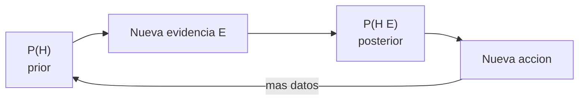

# Bayes y pensamiento estadistico

> Tu intuicion te miente. El teorema de Bayes te corrige.

**Tipo:** Construir
**Lenguajes:** Python
**Prerrequisitos:** 06-probabilidad-y-distribuciones
**Tiempo estimado:** ~30 minutos

## Objetivos de aprendizaje

- Aplicar el teorema de Bayes a problemas reales.
- Diagnosticar el "error de la base rate" en tests medicos.
- Actualizar creencias con nueva evidencia.
- Reconocer cuando un resultado contraintuitivo es correcto.

## El problema

Tienes un test medico con 99% de sensibilidad (detecta la
enfermedad cuando esta presente) y 5% de falsa alarma. La
prevalencia de la enfermedad es 1%. Tu paciente da positivo. ¿Que
probabilidad tiene de estar enfermo?

Tu intuicion dice "el test es 99% confiable, asi que 99%". Tu
intuicion se equivoca. La respuesta correcta es ~17%.

## El concepto



Teorema de Bayes:

```text
P(H | E) = P(E | H) * P(H) / P(E)
```

donde `P(E) = P(E|H) * P(H) + P(E|~H) * P(~H)`.

La clave: el `P(H)` inicial (base rate) domina cuando el test no
es perfecto.

## Constrúyelo

```python
"""
Lección: 07-bayes-y-pensamiento-estadistico
Fase: 01
Prerrequisitos: 06-probabilidad-y-distribuciones
"""
from __future__ import annotations
import sys


def bayes(prior, verosimilitud, falsa_p):
    evidencia = verosimilitud * prior + falsa_p * (1 - prior)
    return (verosimilitud * prior) / evidencia


def main() -> int:
    p = bayes(0.01, 0.99, 0.05)
    print(f"P(enfermedad | test+) = {p:.4f}")
    p2 = bayes(p, 0.99, 0.05)
    print(f"Tras 2 tests+: {p2:.4f}")
    return 0


if __name__ == "__main__":
    sys.exit(main())
```

## Úsalo

```bash
cd code
python3 main.py
```

## Despliégalo

```markdown
---
name: prompt-bayes
description: Aplicar Bayes a un problema concreto
fase: 01
leccion: 07
---

Eres un tutor de probabilidad. Recibiras un problema con tres
valores: prior, verosimilitud, falsa alarma. Tu trabajo:

1. Calcular la probabilidad posterior con Bayes.
2. Explicar el resultado en lenguaje natural.
3. Si el prior es muy bajo y la falsa alarma es alta, advertir
   que la mayor parte de los tests positivos seran falsos positivos.
4. Sugerir como mejorar la precision.
```

## Ejercicios

1. **Cancer de mama**: el test mamografia tiene sensibilidad 80%
   y falsa alarma 10%. Prevalencia 0.5%. ¿P(enfermedad | test+)?
2. **Spam filter**: P(spam) = 0.3. P("oferta" | spam) = 0.8.
   P("oferta" | no spam) = 0.1. ¿P(spam | "oferta")?
3. **Desafio**: implementa la version con multiples tests
   independientes.

## Lecturas recomendadas

- "Think Bayes" (Allen Downey): <https://greenteapress.com/wp/think-bayes/>
- 3Blue1Brown "Bayes theorem": <https://www.3blue1brown.com/topics/bayes>

---

> 📚 **Adaptación al español** de la lección "[Bayes' Theorem and Statistical Thinking]" del currículo [AI Engineering from Scratch](https://github.com/rohitg00/ai-engineering-from-scratch) (Rohit Ghumare, MIT). Implementación y documentación reescritas desde cero. Ver [CREDITS.md](../../../../CREDITS.md).
