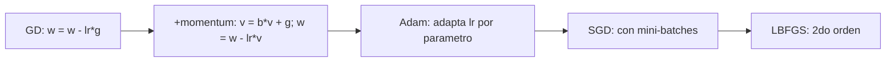

# Optimizacion: familia del descenso por gradiente

> GD, momentum, Adam: la misma idea con tres grados de complejidad. Saber cual usar es la diferencia entre un modelo que converge y uno que no.

**Tipo:** Construir
**Lenguajes:** Python
**Prerrequisitos:** 04-calculo-para-ml, 05-regla-de-la-cadena-y-autodiff
**Tiempo estimado:** ~30 minutos

## Objetivos de aprendizaje

- Implementar descenso por gradiente con gradiente numerico.
- Anadir momentum (Polyak) y comparar.
- Implementar Adam y entender momenta de primer y segundo orden.
- Diagnosticar cuando cada optimizador es mejor.

## El problema

Tienes una funcion de perdida `L(w)`. Quieres minimizar. Tres
familias de algoritmos:

- **GD**: simple, lento, se atasca en saddle points.
- **GD + momentum**: mas rapido, escapa de valles planos.
- **Adam**: robusto, casi siempre converge, pero a veces
  sobreajusta.

Cada uno tiene hyperparametros (lr, beta, eps). Saber elegirlos
es la diferencia entre converger en 1000 iteraciones o 1M.

## El concepto



## Constrúyelo

```python
"""
Lección: 08-optimizacion-familia-gradiente
Fase: 01
Prerrequisitos: 04-calculo-para-ml, 05-regla-de-la-cadena-y-autodiff
"""
from __future__ import annotations
import sys
import numpy as np


def gd(f, w_inicial, lr=0.1, max_iter=1000, tol=1e-6):
    w = list(w_inicial)
    for i in range(max_iter):
        loss = f(*w)
        h = 1e-5
        grad = []
        for j in range(len(w)):
            wp = list(w); wp[j] += h
            wn = list(w); wn[j] -= h
            grad.append((f(*wp) - f(*wn)) / (2 * h))
        w = [wi - lr * g for wi, g in zip(w, grad)]
    return w


def adam(f, w_inicial, lr=0.01, beta1=0.9, beta2=0.999, eps=1e-8, max_iter=1000):
    w = list(w_inicial)
    m = [0.0] * len(w)
    v = [0.0] * len(w)
    for t in range(1, max_iter + 1):
        h = 1e-5
        grad = []
        for j in range(len(w)):
            wp = list(w); wp[j] += h
            wn = list(w); wn[j] -= h
            grad.append((f(*wp) - f(*wn)) / (2 * h))
        m = [beta1 * mi + (1 - beta1) * g for mi, g in zip(m, grad)]
        v = [beta2 * vi + (1 - beta2) * g ** 2 for vi, g in zip(v, grad)]
        m_hat = [mi / (1 - beta1 ** t) for mi in m]
        v_hat = [vi / (1 - beta2 ** t) for vi in v]
        w = [wi - lr * mh / (vh ** 0.5 + eps) for wi, mh, vh in zip(w, m_hat, v_hat)]
    return w


def main() -> int:
    f = lambda x, y: (x - 3) ** 2 + (y + 2) ** 2
    w = gd(f, [0.0, 0.0], max_iter=200)
    print(f"GD -> {w}")
    w = adam(f, [0.0, 0.0], max_iter=500)
    print(f"Adam -> {w}")
    return 0


if __name__ == "__main__":
    sys.exit(main())
```

## Úsalo

```bash
cd code
python3 main.py
```

## Despliégalo

```markdown
---
name: prompt-optim-chooser
description: Elegir el optimizador adecuado
fase: 01
leccion: 08
---

Eres un tutor de optimizacion. Recibiras una descripcion del
problema y debes:

1. Recomendar el optimizador por defecto (Adam).
2. Si el modelo es pequeno y los datos caben en memoria, sugerir
   LBFGS.
3. Si hay overfitting, recomendar SGD + weight decay.
4. Si los gradientes son ruidosos (RL), recomendar gradient clipping.
5. Dar lr inicial por defecto (1e-3 para Adam, 1e-2 para SGD).

Reglas:
- Adam funciona para el 80% de los casos. No recomiendes cambios
  innecesarios.
- Si mencionas lr schedule, especifica el tipo (cosine, step).
```

## Ejercicios

1. **Comparar convergencia**: corre GD vs Adam sobre
   `f(x) = (x-3)^2` desde x=0. ¿Cuantas iteraciones necesita cada uno?
2. **Momentum beta**: prueba beta=0, 0.5, 0.9, 0.99. ¿Cuando
   oscila?
3. **Desafio**: implementa AdaGrad (adaptacion por lr acumulada).

## Lecturas recomendadas

- "An overview of gradient descent optimization algorithms" (Ruder): <https://ruder.io/optimizing-gradient-descent/>
- Adam paper: <https://arxiv.org/abs/1412.6980>
- PyTorch optim: <https://pytorch.org/docs/stable/optim.html>

---

> 📚 **Adaptación al español** de la lección "[Optimization: Gradient Descent Family]" del currículo [AI Engineering from Scratch](https://github.com/rohitg00/ai-engineering-from-scratch) (Rohit Ghumare, MIT). Implementación y documentación reescritas desde cero. Ver [CREDITS.md](../../../../CREDITS.md).
