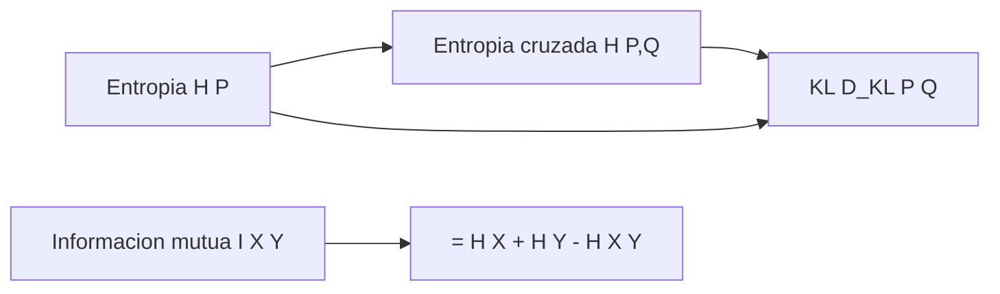

# Teoria de la informacion: entropia, KL, MI

> Cross-entropy loss es teoria de la informacion. Entender entropia, divergencia KL e informacion mutua es entender la mayoria de las perdidas en ML.

**Tipo:** Construir
**Lenguajes:** Python
**Prerrequisitos:** 06-probabilidad-y-distribuciones
**Tiempo estimado:** ~30 minutos

## Objetivos de aprendizaje

- Calcular entropia, entropia cruzada, divergencia KL e informacion mutua.
- Distinguir cuando usar cada una.
- Diagnosticar por que cross-entropy es la perdida clasica en clasificacion.
- Implementar las formulas desde cero.

## El problema

Tu modelo de clasificacion tiene una perdida: `cross_entropy(y_true, y_pred)`. ¿Por que esa formula y no otra? Porque mide cuantos bits necesitas para codificar la distribucion verdadera si usas la distribucion predicha. Es informacion mutua negativa.

Sin entender teoria de la informacion, ajustar la perdida es prueba y error.

## El concepto



Cuatro medidas:

- **H(P)**: informacion en una distribucion.
- **H(P, Q)**: bits para codificar P usando Q.
- **D_KL(P || Q)**: cuanto se parece Q a P. 0 si identicas, >0 si distintas.
- **I(X; Y)**: cuanto dice X sobre Y.

## Constrúyelo

```python
"""
Lección: 09-teoria-de-la-informacion
Fase: 01
Prerequisitos: 06-probabilidad-y-distribuciones
"""
from __future__ import annotations
import sys
import numpy as np


def entropia(probs, base=2.0):
    p = np.asarray(probs, dtype=float)
    p = p[p > 0]
    return float(-np.sum(p * np.log2(p)))


def divergencia_kl(p, q):
    p = np.asarray(p, dtype=float)
    q = np.asarray(q, dtype=float)
    return float(np.sum(p * np.log2(p / q)))


def entropia_cruzada(p, q):
    p = np.asarray(p, dtype=float)
    q = np.asarray(q, dtype=float)
    return float(-np.sum(p * np.log2(q)))


def informacion_mutua(p_xy):
    p = np.asarray(p_xy, dtype=float)
    p_x = p.sum(axis=1)
    p_y = p.sum(axis=0)
    return entropia(p_x) + entropia(p_y) - entropia(p)


def main() -> int:
    p = np.array([0.5, 0.5])
    print(f"H(P) = {entropia(p):.3f}")
    q = np.array([0.9, 0.1])
    print(f"D_KL(P||Q) = {divergencia_kl(p, q):.3f}")
    print(f"H(P, Q) = {entropia_cruzada(p, q):.3f}")
    return 0


if __name__ == "__main__":
    sys.exit(main())
```

## Úsalo

```bash
cd code
python3 main.py
```

## Despliégalo

```markdown
---
name: prompt-loss-chooser
description: Elegir la funcion de perdida adecuada
fase: 01
leccion: 09
---

Eres un tutor de perdidas. Recibiras una descripcion del problema
y debes:

1. Recomendar la perdida por defecto segun el tipo:
   - Clasificacion binaria: Binary Cross Entropy.
   - Clasificacion multiclase: Categorical Cross Entropy.
   - Regresion: MSE o Huber.
   - Generacion: Cross Entropy.
2. Justificar en una linea usando teoria de la informacion.
3. Advertir si hay desbalance de clases (usar focal loss o pesos).
4. Si la salida es probabilistica, asegurar que se normaliza.

Reglas:
- Cross-entropy siempre que haya softmax/sigmoid.
- MSE solo para regresion con salida real.
- Huber es MSE + L1, robusto a outliers.
```

## Ejercicios

1. **Entropia maxima**: verifica que la distribucion uniforme
   maximiza la entropia para n fijo.
2. **KL en clasificacion**: muestra que
   `cross_entropy = entropy(true) + KL(true || pred)`.
3. **Desafio**: implementa la perdida focal para datos desbalanceados:
   `FL(p_t) = -alpha_t (1 - p_t)^gamma log(p_t)`.

## Lecturas recomendadas

- "Information Theory, Inference, and Learning Algorithms" (MacKay)
- 3Blue1Brown: <https://www.3blue1brown.com/topics/information-theory>
- "The Elements of Information Theory" (Cover & Thomas)

---

> 📚 **Adaptación al español** de la lección "[Information Theory]" del currículo [AI Engineering from Scratch](https://github.com/rohitg00/ai-engineering-from-scratch) (Rohit Ghumare, MIT). Implementación y documentación reescritas desde cero. Ver [CREDITS.md](../../../../CREDITS.md).
