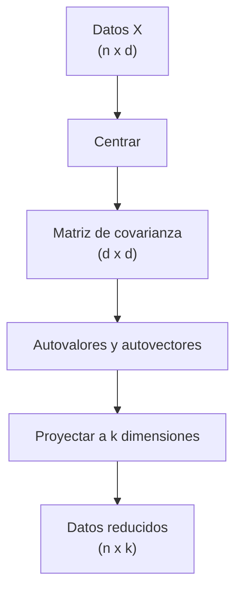

# Reduccion de dimensionalidad: PCA, t-SNE, UMAP

> 1000 features es mucho. PCA te da las 50 que importan. t-SNE/UMAP te dan 2 para visualizar.

**Tipo:** Construir
**Lenguajes:** Python
**Prerrequisitos:** 03-transformaciones-valores-propios, 06-probabilidad-y-distribuciones
**Tiempo estimado:** ~45 minutos

## Objetivos de aprendizaje

- Implementar PCA desde cero con eigendecomposicion.
- Medir varianza explicada por componente.
- Visualizar el efecto de PCA en datos 2D y 3D.
- Diagnosticar cuando PCA es insuficiente (no lineal).

## El problema

Tienes 1000 features por muestra. El modelo sobreajusta, es lento
y dificil de interpretar. PCA proyecta a 50 dimensiones preservando
la maxima varianza. Si la varianza preservada es 90%, perdiste solo
10% de informacion.

## El concepto



PCA:

1. Centra los datos (media 0).
2. Calcula la matriz de covarianza.
3. Encuentra los k mayores autovalores/vectores.
4. Proyecta los datos sobre esos vectores.

## Constrúyelo

```python
"""
Lección: 10-reduccion-de-dimensionalidad
Fase: 01
Prerrequisitos: 03-transformaciones-valores-propios, 06-probabilidad-y-distribuciones
"""
from __future__ import annotations
import sys
import numpy as np


def centrar(X):
    return X - X.mean(axis=0)


def covarianza(X):
    Xc = centrar(X)
    return (Xc.T @ Xc) / (X.shape[0] - 1)


def pca(X, k):
    Xc = centrar(X)
    cov = (Xc.T @ Xc) / (X.shape[0] - 1)
    autovalores, autovectores = np.linalg.eigh(cov)
    idx = np.argsort(autovalores)[::-1][:k]
    componentes = autovectores[:, idx]
    return componentes, Xc @ componentes


def main() -> int:
    rng = np.random.default_rng(42)
    X = rng.normal(size=(200, 3))
    X[:, 2] = X[:, 0] + X[:, 1]
    comp, proy = pca(X, k=2)
    print(f"Forma proyectada: {proy.shape}")
    return 0


if __name__ == "__main__":
    sys.exit(main())
```

## Úsalo

```bash
cd code
python3 main.py
```

## Despliégalo

```markdown
---
name: prompt-dr-elegir
description: Elegir el metodo de reduccion de dimensionalidad
fase: 01
leccion: 10
---

Eres un tutor de ML. Recibiras una descripcion del problema
y debes:

1. Recomendar PCA como default (lineal, rapido, interpretable).
2. Si los datos no son linealmente separables, sugerir t-SNE o
   UMAP para visualizacion.
3. Para features interpretables, sugerir PCA con rotacion varimax.
4. Si los datos son texto, usar TruncatedSVD sobre tf-idf (LSA).
5. Advertir contra usar t-SNE para clusterizar (es solo visual).

Reglas:
- t-SNE/UMAP no preservan distancias globales, solo locales.
- PCA preserva las direcciones de mayor varianza; LDA las de mayor
  separabilidad entre clases.
- Para >100k muestras, usar IncrementalPCA o TruncatedSVD.
```

## Ejercicios

1. **Varianza explicada**: para X con 5 features, calcula cuantos
   componentes necesitas para explicar 90% de la varianza.
2. **Reconstruccion**: mide el error de reconstruccion para k=1, 2,
   3, 5, 10.
3. **Desafio**: implementa KernelPCA con kernel RBF para datos
   no linealmente separables.

## Lecturas recomendadas

- sklearn PCA: <https://scikit-learn.org/stable/modules/decomposition.html#pca>
- "Interpretation of PCA": <https://arxiv.org/abs/1404.1100>
- UMAP: <https://umap-learn.readthedocs.io/>
- t-SNE: <https://lvdmaaten.github.io/tsne/>

---

> 📚 **Adaptación al español** de la lección "[Dimensionality Reduction: PCA, t-SNE, UMAP]" del currículo [AI Engineering from Scratch](https://github.com/rohitg00/ai-engineering-from-scratch) (Rohit Ghumare, MIT). Implementación y documentación reescritas desde cero. Ver [CREDITS.md](../../../../CREDITS.md).
