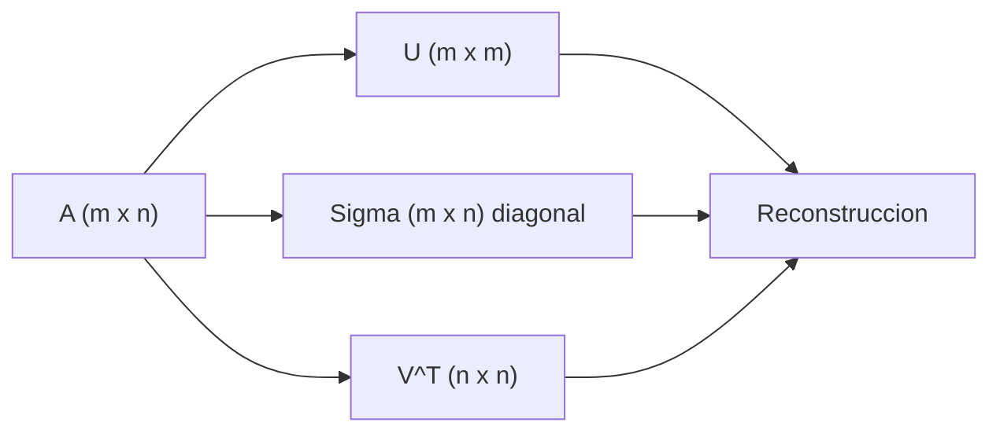

# Descomposicion en valores singulares (SVD)

> SVD es la "descomposicion universal" de matrices. PCA, LSA, compresion y recomendadores son casos especiales.

**Tipo:** Construir
**Lenguajes:** Python
**Prerrequisitos:** 03-transformaciones-valores-propios
**Tiempo estimado:** ~30 minutos

## Objetivos de aprendizaje

- Implementar SVD via NumPy.
- Reconstruir matrices con k valores singulares.
- Diagnosticar condicion numerico.
- Aplicar SVD truncado a compresion y LSA.

## El problema

Toda matriz A (m x n) se puede factorizar como A = U Sigma V^T, donde U y V son ortogonales y Sigma es diagonal con valores singulares no negativos. Esta descomposicion existe SIEMPRE, incluso para matrices no cuadradas o no invertibles.

## El concepto



## Constrúyelo

```python
"""
Lección: 11-descomposicion-svd
Fase: 01
Prerrequisitos: 03-transformaciones-valores-propios
"""
from __future__ import annotations
import sys
import numpy as np


def svd(A):
    return np.linalg.svd(A, full_matrices=False)


def reconstruccion(U, S, Vt, k):
    return U[:, :k] @ np.diag(S[:k]) @ Vt[:k, :]


def main() -> int:
    A = np.array([[1.0, 2.0, 3.0], [4.0, 5.0, 6.0], [7.0, 8.0, 9.0]])
    U, S, Vt = svd(A)
    for k in [1, 2, 3]:
        A_k = reconstruccion(U, S, Vt, k)
        err = np.linalg.norm(A - A_k)
        print(f"  k={k}: error={err:.4f}")
    return 0


if __name__ == "__main__":
    sys.exit(main())
```

## Úsalo

```bash
cd code
python3 main.py
```

## Despliégalo

```markdown
---
name: prompt-svd-diagnostico
description: Diagnosticar problemas numericos con SVD
fase: 01
leccion: 11
---

Eres un tutor de algebra lineal. Recibiras un problema con SVD
y debes:

1. Si hay NaN, verificar condicionamiento.
2. Para matrices sparse grandes, recomendar scipy.sparse.linalg.svds.
3. Si los valores singulares decaen lentamente, SVD truncado
   comprime bien.
4. Advertir que np.linalg.svd no escala, mientras scipy.linalg.svd
   tiene modes especializados.

Reglas:
- TruncatedSVD de sklearn para matrices dispersas.
- Si el rango efectivo es bajo, usar randomized SVD.
```

## Ejercicios

1. **Compresion de imagen**: aplica SVD a una imagen en escala de
   grises y mide el error para k=10, 50, 100, 200.
2. **Pseudo-inversa**: implementa la pseudo-inversa via SVD.
3. **Desafio**: implementa LSA sobre un corpus de texto usando
   TruncatedSVD de sklearn.

## Lecturas recomendadas

- "Matrix Computations" (Golub & Van Loan)
- sklearn TruncatedSVD: <https://scikit-learn.org/stable/modules/generated/sklearn.decomposition.TruncatedSVD.html>

---

> 📚 **Adaptación al español** de la lección "[Singular Value Decomposition]" del currículo [AI Engineering from Scratch](https://github.com/rohitg00/ai-engineering-from-scratch) (Rohit Ghumare, MIT). Implementación y documentación reescritas desde cero. Ver [CREDITS.md](../../../../CREDITS.md).