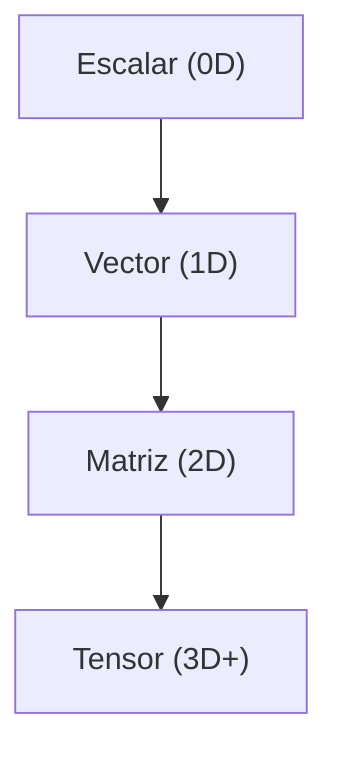

# Operaciones con tensores

> Tensores son el pan de cada dia en PyTorch/TensorFlow. Saber sus operaciones evita horas de debugging.

**Tipo:** Construir
**Lenguajes:** Python
**Prerrequisitos:** 01-intuicion-algebra-lineal
**Tiempo estimado:** ~30 minutos

## Objetivos de aprendizaje

- Distinguir entre escalar, vector, matriz y tensor n-dimensional.
- Aplicar reshape, transpose y broadcast correctamente.
- Implementar multiplicacion de matrices batch con einsum.
- Diagnosticar errores de shapes.

## El concepto



- **Shape**: tupla con el tamano de cada dimension.
- **Reshape**: reorganiza el mismo numero de elementos.
- **Transpose**: permuta ejes.
- **Broadcast**: expande dimensiones de tamano 1.

## Constrúyelo

```python
"""
Lección: 12-operaciones-con-tensores
Fase: 01
Prerrequisitos: 01-intuicion-algebra-lineal
"""
from __future__ import annotations
import sys
import numpy as np


def shape(t):
    return t.shape


def ndim(t):
    return t.ndim


def reshape(t, new_shape):
    return t.reshape(new_shape)


def transpose(t, axes=None):
    return np.transpose(t, axes=axes)


def broadcast(a, b):
    return a + b


def matmul(a, b):
    return a @ b


def einsum(espec, *args):
    return np.einsum(espec, *args)


def main() -> int:
    T = np.arange(24).reshape(2, 3, 4)
    print(f"Shape: {shape(T)}")
    print(f"Transpuesto: {transpose(T, (0, 2, 1)).shape}")
    print(f"Batch matmul shape: {matmul(np.random.random((5, 3, 4)), np.random.random((5, 4, 2))).shape}")
    return 0


if __name__ == "__main__":
    sys.exit(main())
```

## Úsalo

```bash
cd code
python3 main.py
```

## Despliégalo

```markdown
---
name: prompt-tensor-shape
description: Diagnosticar problemas de shapes y broadcasting
fase: 01
leccion: 12
---

Eres un tutor de tensores. Recibiras un fragmento de codigo NumPy/
PyTorch y un error de shape. Tu trabajo:

1. Identificar las shapes de los operandos.
2. Explicar por que no son compatibles.
3. Proponer la transformacion necesaria.
4. Si es broadcasting, explicar las reglas de NumPy.
5. Dar el codigo corregido minimo.

Reglas:
- Para PyTorch, distingue entre unsqueeze(0) y unsqueeze(1).
- Si recomiendas einsum, explica la especificacion.
```

## Ejercicios

1. **Broadcasting**: predice la shape de
   `np.zeros((3, 1)) + np.zeros((1, 4))`. Ejecuta y verifica.
2. **Einsum**: implementa la atencion escalada
   `softmax(QK^T / sqrt(d)) @ V` con einsum.
3. **Desafio**: implementa una capa convolucional 2D desde cero
   con im2col + matmul.

## Lecturas recomendadas

- NumPy broadcasting: <https://numpy.org/doc/stable/user/basics.broadcasting.html>
- einsum: <https://numpy.org/doc/stable/reference/generated/numpy.einsum.html>
- PyTorch tensor operations: <https://pytorch.org/docs/stable/torch.html>

---

> 📚 **Adaptación al español** de la lección "[Tensor Operations]" del currículo [AI Engineering from Scratch](https://github.com/rohitg00/ai-engineering-from-scratch) (Rohit Ghumare, MIT). Implementación y documentación reescritas desde cero. Ver [CREDITS.md](../../../../CREDITS.md).