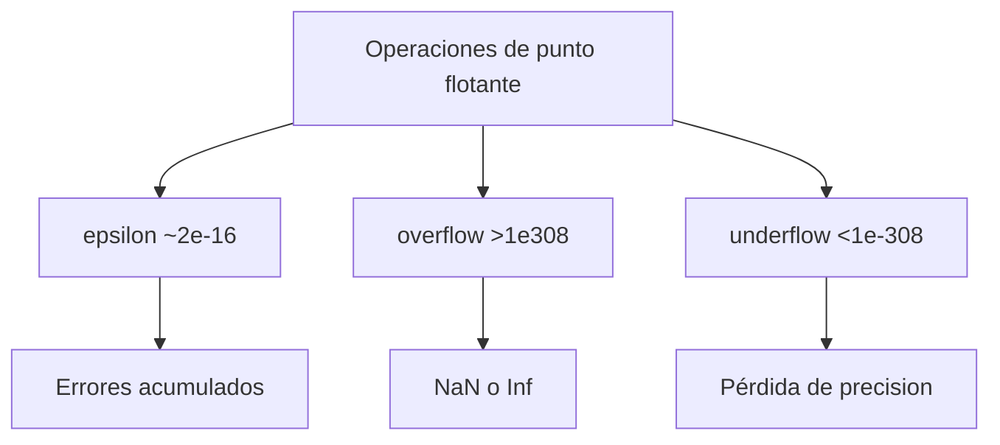

# Estabilidad numerica

> Tu softmax explota. Tu perdida es NaN. Bienvenido a la computo numerica.

**Tipo:** Construir
**Lenguajes:** Python
**Prerrequisitos:** 01-intuicion-algebra-lineal
**Tiempo estimado:** ~30 minutos

## Objetivos de aprendizaje

- Diagnosticar overflow y underflow en operaciones basicas.
- Implementar softmax numericamente estable.
- Medir el condicionamiento de matrices.
- Conocer epsilon de maquina y limites de float64.

## El concepto



## Constrúyelo

```python
"""
Lección: 13-estabilidad-numerica
Fase: 01
Prerrequisitos: 01-intuicion-algebra-lineal
"""
from __future__ import annotations
import sys
import numpy as np


def epsilon_maquina():
    return np.finfo(float).eps


def softmax_estable(x):
    x_shift = x - np.max(x)
    ex = np.exp(x_shift)
    return ex / ex.sum()


def condicion_matriz(A):
    return np.linalg.cond(A)


def main() -> int:
    print(f"Epsilon: {epsilon_maquina()}")
    x = np.array([1000.0, 1001.0, 1002.0])
    print(f"Softmap estable: {softmax_estable(x)}")
    return 0


if __name__ == "__main__":
    sys.exit(main())
```

## Úsalo

```bash
cd code
python3 main.py
```

## Despliégalo

```markdown
---
name: prompt-numerico
description: Diagnosticar problemas de estabilidad numerica
fase: 01
leccion: 13
---

Eres un tutor de computo numerico. Tu trabajo:

1. Si hay NaN/Inf, sospechar division por cero, log(0) o exp overflow.
2. Si el modelo no aprende, sospechar gradientes vanishing/exploding.
3. Recomendar grad clipping.
4. Recomendar float64 solo para computos cientificos.

Reglas:
- Softmax estable: restar max antes de exp.
- Log estable: clip a epsilon antes de log.
- BatchNorm, LayerNorm, Residual: mitigan gradientes.
```

## Ejercicios

1. **Epsilon**: imprime el epsilon de tu maquina. Compara con
   `sys.float_info.epsilon`.
2. **Softmax**: implementa softmax estable para un vector con
   valores en [0, 1000] y verifica que suma 1.
3. **Desafio**: implementa log-sum-exp numericamente estable.

## Lecturas recomendadas

- "Numerical Recipes" (Press et al.)
- IEEE 754: <https://ieeexplore.ieee.org/document/4610935>
- "What Every Computer Scientist Should Know About Floating-Point" (Goldberg)

---

> 📚 **Adaptación al español** de la lección "[Numerical Stability]" del currículo [AI Engineering from Scratch](https://github.com/rohitg00/ai-engineering-from-scratch) (Rohit Ghumare, MIT). Implementación y documentación reescritas desde cero. Ver [CREDITS.md](../../../../CREDITS.md).