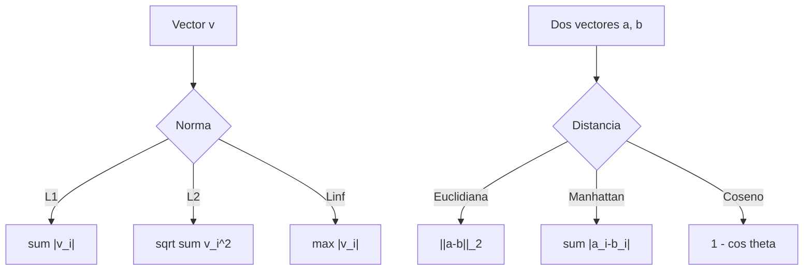

# Normas y distancias

> Como mides 'que tan cerca' o 'que tan diferente' es una cosa de otra.

**Tipo:** Construir
**Lenguajes:** Python
**Prerrequisitos:** 12-operaciones-con-tensores
**Tiempo estimado:** ~30 minutos

## Objetivos de aprendizaje

- Implementar normas L1, L2, Lp, L-infinito.
- Distinguir entre distancia euclidiana, Manhattan y coseno.
- Elegir la distancia adecuada segun el problema.

## El concepto



## Constrúyelo

```python
from __future__ import annotations
import sys
import numpy as np

def norma_l1(v): return float(np.sum(np.abs(v)))
def norma_l2(v): return float(np.sqrt(np.sum(v ** 2)))
def distancia_euclidiana(a, b): return float(np.sqrt(np.sum((a - b) ** 2)))
def distancia_coseno(a, b):
    return 1.0 - float(np.dot(a, b) / (norma_l2(a) * norma_l2(b)))
```

## Úsalo

```bash
cd code
python3 main.py
```

## Despliégalo

```markdown
---
name: prompt-distancia-elegir
description: Elegir la distancia adecuada al problema
fase: 01
leccion: 14
---

Eres un tutor de algebra. Recibiras una descripcion del problema
y debes:

1. Para embeddings de texto, recomendar coseno.
2. Para imagenes o coordenadas, recomendar euclidiana.
3. Para caracteristicas con outliers, recomendar L1 o Manhattan.
4. Para KNN clasico, recomendar euclidiana o Minkowski.
5. Para clustering jerarquico, recomendar linkage + euclidiana.

Reglas:
- Coseno ignora magnitud, euclidiana no.
- L1 es robusto a outliers, L2 no.
- Mahalanobis considera covarianza.
```

## Ejercicios

1. **Mahalanobis**: implementa distancia de Mahalanobis que
   considera la covarianza.
2. **Matriz de distancias**: para 100 puntos, construye la
   matriz N x N de distancias euclidianas.
3. **Desafio**: implementa K-Nearest Neighbors con distancia coseno.

## Lecturas recomendadas

- "Matrix Cookbook": <https://www.math.uwaterloo.ca/~hwolkowi/matrixcookbook.pdf>
- sklearn metrics: <https://scikit-learn.org/stable/modules/model_evaluation.html>

---

> 📚 **Adaptación al español** de la lección "[Norms and Distances]" del currículo [AI Engineering from Scratch](https://github.com/rohitg00/ai-engineering-from-scratch) (Rohit Ghumare, MIT). Implementación y documentación reescritas desde cero. Ver [CREDITS.md](../../../../CREDITS.md).